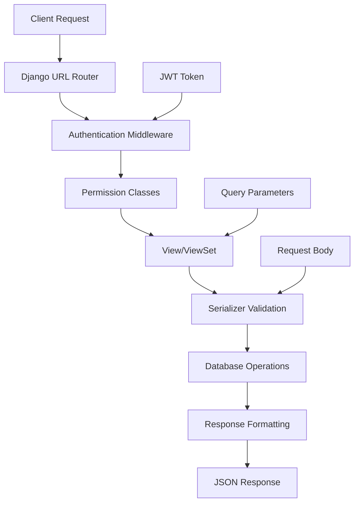

# API Endpoints and Views 🔌

In this comprehensive guide, we'll explore all the API endpoints, views, and request/response handling in our Django REST Framework application. Understanding how to build and consume RESTful APIs is crucial for modern web development.

## 📚 Table of Contents

1. [🏗️ Overview](#️-overview)
2. [🔗 URL Routing](#-url-routing)
3. [👥 Authentication Endpoints](#-authentication-endpoints)
4. [📋 Task Management Endpoints](#-task-management-endpoints)
5. [🔍 Request/Response Format](#-requestresponse-format)
6. [🛡️ Permissions and Security](#️-permissions-and-security)
7. [🔍 Filtering and Searching](#-filtering-and-searching)
8. [📄 Pagination](#-pagination)
9. [🧪 API Testing](#-api-testing)
10. [📚 API Documentation](#-api-documentation)

---

## 🏗️ Overview

Our REST API follows these principles:

- **🎯 RESTful Design**: Proper use of HTTP methods and status codes
- **🔐 Secure Authentication**: JWT-based authentication
- **📊 Resource-based URLs**: Clear, intuitive endpoint structure
- **🔍 Flexible Filtering**: Search and filter capabilities
- **📄 Pagination**: Efficient data retrieval for large datasets
- **📚 Auto-documentation**: Interactive Swagger documentation

### 🏛️ API Architecture



---

## 🔗 URL Routing

### 🌐 URL Configuration Structure

Our API URLs are organized in a hierarchical structure:

```python
# core/urls.py
from django.contrib import admin
from django.urls import path, include
from django.conf import settings
from django.conf.urls.static import static

urlpatterns = [
    path('admin/', admin.site.urls),
    path('api/', include('users.urls')),
    path('api/', include('tasks.urls')),
]

if settings.DEBUG:
    urlpatterns += static(settings.MEDIA_URL, settings.MEDIA_ROOT)
```

### 📋 App-specific URL Configurations

#### Users App URLs (`users/urls.py`)

```python
from django.urls import path
from rest_framework_simplejwt.views import (
    TokenObtainPairView,
    TokenRefreshView,
)
from .views import RegisterView

urlpatterns = [
    path('auth/register/', RegisterView.as_view(), name='register'),
    path('auth/login/', TokenObtainPairView.as_view(), name='token_obtain_pair'),
    path('auth/token/refresh/', TokenRefreshView.as_view(), name='token_refresh'),
]
```

#### Tasks App URLs (`tasks/urls.py`)

```python
from django.urls import path, include
from rest_framework.routers import DefaultRouter
from .views import TaskViewSet

router = DefaultRouter()
router.register(r'tasks', TaskViewSet, basename='task')

urlpatterns = [
    path('', include(router.urls)),
]
```

### 🌍 Complete API URL Map

| URL Pattern | HTTP Method | View | Description |
|-------------|-------------|------|-------------|
| `/api/auth/register/` | POST | RegisterView | User registration |
| `/api/auth/login/` | POST | TokenObtainPairView | JWT token obtain |
| `/api/auth/token/refresh/` | POST | TokenRefreshView | JWT token refresh |
| `/api/tasks/` | GET | TaskViewSet | List tasks |
| `/api/tasks/` | POST | TaskViewSet | Create task |
| `/api/tasks/{id}/` | GET | TaskViewSet | Retrieve task |
| `/api/tasks/{id}/` | PUT | TaskViewSet | Update task |
| `/api/tasks/{id}/` | PATCH | TaskViewSet | Partial update task |
| `/api/tasks/{id}/` | DELETE | TaskViewSet | Delete task |

---

## 👥 Authentication Endpoints

### 🎫 JWT Token-based Authentication

We use JSON Web Tokens (JWT) for secure, stateless authentication. JWT consists of two tokens:

1. **Access Token**: Short-lived (5-15 minutes) token for API requests
2. **Refresh Token**: Long-lived token for obtaining new access tokens

### 📝 User Registration

**Endpoint:** `POST /api/auth/register/`

**Request Body:**
```json
{
    "username": "john_doe",
    "email": "john@example.com",
    "password": "secure_password123",
    "password_confirm": "secure_password123"
}
```

**Success Response (201 Created):**
```json
{
    "id": 1,
    "username": "john_doe",
    "email": "john@example.com",
    "date_joined": "2024-01-15T10:30:00.123456Z"
}
```

**Error Response (400 Bad Request):**
```json
{
    "username": ["A user with that username already exists."],
    "email": ["Enter a valid email address."],
    "password_confirm": ["Passwords must match."]
}
```

### 🔑 User Login (Token Obtain)

**Endpoint:** `POST /api/auth/login/`

**Request Body:**
```json
{
    "username": "john_doe",
    "password": "secure_password123"
}
```

**Success Response (200 OK):**
```json
{
    "access": "eyJ0eXAiOiJKV1QiLCJhbGciOiJIUzI1NiJ9...",
    "refresh": "eyJ0eXAiOiJKV1QiLCJhbGciOiJIUzI1NiJ9...",
    "user": {
        "id": 1,
        "username": "john_doe",
        "email": "john@example.com"
    }
}
```

**Error Response (401 Unauthorized):**
```json
{
    "detail": "No active account found with the given credentials"
}
```

### 🔄 Token Refresh

**Endpoint:** `POST /api/auth/token/refresh/`

**Request Body:**
```json
{
    "refresh": "eyJ0eXAiOiJKV1QiLCJhbGciOiJIUzI1NiJ9..."
}
```

**Success Response (200 OK):**
```json
{
    "access": "eyJ0eXAiOiJKV1QiLCJhbGciOiJIUzI1NiJ9..."
}
```

**Error Response (401 Unauthorized):**
```json
{
    "detail": "Token is invalid or expired",
    "code": "token_not_valid"
}
```

### 🧪 Authentication Testing

```bash
# Register a new user
curl -X POST http://127.0.0.1:8000/api/auth/register/ \
  -H "Content-Type: application/json" \
  -d '{
    "username": "testuser",
    "email": "test@example.com",
    "password": "testpass123",
    "password_confirm": "testpass123"
  }'

# Login and get tokens
curl -X POST http://127.0.0.1:8000/api/auth/login/ \
  -H "Content-Type: application/json" \
  -d '{
    "username": "testuser",
    "password": "testpass123"
  }'
```

---

## 📋 Task Management Endpoints

### 🎯 Task ViewSet Implementation

Our TaskViewSet uses Django REST Framework's `ModelViewSet` for full CRUD operations:

```python
# tasks/views.py
from rest_framework import viewsets, permissions, filters
from rest_framework.decorators import action
from rest_framework.response import Response
from django_filters.rest_framework import DjangoFilterBackend
from .models import Task
from .serializers import TaskSerializer
from .permissions import IsOwnerPermission

class TaskViewSet(viewsets.ModelViewSet):
    """
    ViewSet for managing tasks.
    Provides full CRUD operations with user-specific filtering.
    """
    queryset = Task.objects.all()
    serializer_class = TaskSerializer
    permission_classes = [permissions.IsAuthenticated, IsOwnerPermission]
    filter_backends = [DjangoFilterBackend, filters.SearchFilter, filters.OrderingFilter]
    filterset_fields = ['completed']
    search_fields = ['title', 'description']
    ordering_fields = ['created_at', 'updated_at', 'title']
    ordering = ['-created_at']

    def get_queryset(self):
        """
        Return tasks for the currently authenticated user only.
        """
        return Task.objects.filter(user=self.request.user)

    def perform_create(self, serializer):
        """
        Automatically set the user to the currently authenticated user.
        """
        serializer.save(user=self.request.user)
```

### 📊 Task List (GET /api/tasks/)

**Request:**
```bash
GET /api/tasks/
Authorization: Bearer YOUR_ACCESS_TOKEN
```

**Query Parameters:**
- `page`: Page number for pagination (default: 1)
- `page_size`: Number of items per page (default: 10)
- `completed`: Filter by completion status (`true` or `false`)
- `search`: Search in title and description
- `ordering`: Order by field (`created_at`, `-created_at`, `title`, etc.)

**Success Response (200 OK):**
```json
{
    "count": 25,
    "next": "http://127.0.0.1:8000/api/tasks/?page=2",
    "previous": null,
    "results": [
        {
            "id": 1,
            "title": "Complete project documentation",
            "description": "Write comprehensive README and API docs",
            "completed": false,
            "created_at": "2024-01-15T10:30:00.123456Z",
            "updated_at": "2024-01-15T10:30:00.123456Z"
        },
        {
            "id": 2,
            "title": "Review pull requests",
            "description": "Check and approve pending PRs",
            "completed": true,
            "created_at": "2024-01-14T15:45:00.654321Z",
            "updated_at": "2024-01-15T09:20:00.987654Z"
        }
    ]
}
```

### ➕ Create Task (POST /api/tasks/)

**Request:**
```bash
POST /api/tasks/
Authorization: Bearer YOUR_ACCESS_TOKEN
Content-Type: application/json

{
    "title": "New Task",
    "description": "Task description here"
}
```

**Success Response (201 Created):**
```json
{
    "id": 3,
    "title": "New Task",
    "description": "Task description here",
    "completed": false,
    "created_at": "2024-01-16T14:20:00.123456Z",
    "updated_at": "2024-01-16T14:20:00.123456Z"
}
```

**Error Response (400 Bad Request):**
```json
{
    "title": ["This field is required."],
    "description": ["This field may not be blank."]
}
```

### 🔍 Retrieve Task (GET /api/tasks/{id}/)

**Request:**
```bash
GET /api/tasks/1/
Authorization: Bearer YOUR_ACCESS_TOKEN
```

**Success Response (200 OK):**
```json
{
    "id": 1,
    "title": "Complete project documentation",
    "description": "Write comprehensive README and API docs",
    "completed": false,
    "created_at": "2024-01-15T10:30:00.123456Z",
    "updated_at": "2024-01-15T10:30:00.123456Z"
}
```

**Error Response (404 Not Found):**
```json
{
    "detail": "Not found."
}
```

**Error Response (403 Forbidden):**
```json
{
    "detail": "You do not have permission to perform this action."
}
```

### ✏️ Update Task (PUT /api/tasks/{id}/)

**Request:**
```bash
PUT /api/tasks/1/
Authorization: Bearer YOUR_ACCESS_TOKEN
Content-Type: application/json

{
    "title": "Updated Task Title",
    "description": "Updated task description",
    "completed": true
}
```

**Success Response (200 OK):**
```json
{
    "id": 1,
    "title": "Updated Task Title",
    "description": "Updated task description",
    "completed": true,
    "created_at": "2024-01-15T10:30:00.123456Z",
    "updated_at": "2024-01-16T14:25:00.987654Z"
}
```

### 🔧 Partial Update (PATCH /api/tasks/{id}/)

**Request:**
```bash
PATCH /api/tasks/1/
Authorization: Bearer YOUR_ACCESS_TOKEN
Content-Type: application/json

{
    "completed": true
}
```

**Success Response (200 OK):**
```json
{
    "id": 1,
    "title": "Complete project documentation",
    "description": "Write comprehensive README and API docs",
    "completed": true,
    "created_at": "2024-01-15T10:30:00.123456Z",
    "updated_at": "2024-01-16T14:30:00.123456Z"
}
```

### 🗑️ Delete Task (DELETE /api/tasks/{id}/)

**Request:**
```bash
DELETE /api/tasks/1/
Authorization: Bearer YOUR_ACCESS_TOKEN
```

**Success Response (204 No Content):**
```
(no response body)
```

---

## 🔍 Request/Response Format

### 📋 Standard Response Structure

#### **Success Responses**

**200 OK (GET, PUT, PATCH):**
```json
{
    "id": 1,
    "title": "Task Title",
    "description": "Task Description",
    "completed": false,
    "created_at": "2024-01-15T10:30:00.123456Z",
    "updated_at": "2024-01-15T10:30:00.123456Z"
}
```

**201 Created (POST):**
```json
{
    "id": 1,
    "title": "Task Title",
    "description": "Task Description",
    "completed": false,
    "created_at": "2024-01-15T10:30:00.123456Z",
    "updated_at": "2024-01-15T10:30:00.123456Z"
}
```

**204 No Content (DELETE):**
```
(no response body)
```

#### **Error Responses**

**400 Bad Request (Validation Errors):**
```json
{
    "title": ["This field is required."],
    "description": ["This field may not be blank."],
    "non_field_errors": ["Some global error message"]
}
```

**401 Unauthorized (Authentication Required):**
```json
{
    "detail": "Authentication credentials were not provided."
}
```

**403 Forbidden (Permission Denied):**
```json
{
    "detail": "You do not have permission to perform this action."
}
```

**404 Not Found:**
```json
{
    "detail": "Not found."
}
```

**500 Internal Server Error:**
```json
{
    "detail": "A server error occurred."
}
```

### 🎯 HTTP Status Codes

| Status Code | Meaning | Usage |
|-------------|---------|-------|
| 200 | OK | Successful GET, PUT, PATCH |
| 201 | Created | Successful POST |
| 204 | No Content | Successful DELETE |
| 400 | Bad Request | Validation errors |
| 401 | Unauthorized | Authentication required |
| 403 | Forbidden | Permission denied |
| 404 | Not Found | Resource doesn't exist |
| 405 | Method Not Allowed | Unsupported HTTP method |
| 500 | Internal Server Error | Server error |

---

## 🛡️ Permissions and Security

### 🔒 Permission Classes

Our API uses multiple layers of permission checking:

```python
# tasks/views.py
permission_classes = [
    permissions.IsAuthenticated,  # Must be logged in
    IsOwnerPermission            # Must own the resource
]
```

#### **1. IsAuthenticated Permission**

Ensures the user is authenticated before accessing any endpoint:

```python
from rest_framework import permissions

class IsAuthenticated(permissions.BasePermission):
    """
    Allows access only to authenticated users.
    """
    def has_permission(self, request, view):
        return bool(request.user and request.user.is_authenticated)
```

#### **2. IsOwnerPermission (Custom)**

Ensures users can only access their own tasks:

```python
# tasks/permissions.py
from rest_framework import permissions

class IsOwnerPermission(permissions.BasePermission):
    """
    Custom permission to only allow owners of an object to edit it.
    """

    def has_object_permission(self, request, view, obj):
        # Read permissions are allowed to any request,
        # so we'll always allow GET, HEAD or OPTIONS requests.
        if request.method in permissions.SAFE_METHODS:
            return True

        # Write permissions are only allowed to the owner of the task
        return obj.user == request.user
```

### 🛡️ Security Headers

Django automatically adds security headers:

```http
X-Frame-Options: DENY
X-Content-Type-Options: nosniff
X-XSS-Protection: 1; mode=block
Content-Security-Policy: default-src 'self'
```

### 🔐 API Security Best Practices

1. **Always use HTTPS** in production
2. **Validate all input** using serializers
3. **Use proper permissions** for all endpoints
4. **Never expose sensitive data** in responses
5. **Implement rate limiting** for public endpoints
6. **Log security events** and monitor for suspicious activity

---

## 🔍 Filtering and Searching

### 🔧 Built-in Filtering Configuration

```python
# tasks/views.py
filter_backends = [
    DjangoFilterBackend,    # Exact field filtering
    filters.SearchFilter,   # Text search
    filters.OrderingFilter  # Result ordering
]

filterset_fields = ['completed']      # Filter by exact match
search_fields = ['title', 'description']  # Search in these fields
ordering_fields = ['created_at', 'updated_at', 'title']  # Allowed ordering
ordering = ['-created_at']  # Default ordering
```

### 🔍 Query Parameter Examples

#### **1. Exact Field Filtering**

```bash
# Get completed tasks only
GET /api/tasks/?completed=true

# Get pending tasks only
GET /api/tasks/?completed=false
```

#### **2. Text Search**

```bash
# Search for tasks containing "urgent" in title or description
GET /api/tasks/?search=urgent

# Search for tasks containing "documentation"
GET /api/tasks/?search=documentation
```

#### **3. Ordering**

```bash
# Order by creation date (newest first)
GET /api/tasks/?ordering=-created_at

# Order by creation date (oldest first)
GET /api/tasks/?ordering=created_at

# Order by title alphabetically
GET /api/tasks/?ordering=title

# Order by multiple fields
GET /api/tasks/?ordering=completed,-created_at
```

#### **4. Combined Filtering**

```bash
# Get pending tasks containing "important" ordered by creation date
GET /api/tasks/?completed=false&search=important&ordering=-created_at

# Get completed tasks created recently
GET /api/tasks/?completed=true&search=project&ordering=-created_at
```

### 🛠️ Custom Filtering

You can add custom filtering logic:

```python
# tasks/views.py
from django.db.models import Q

class TaskViewSet(viewsets.ModelViewSet):
    # ... existing code ...

    def get_queryset(self):
        """
        Custom filtering based on query parameters.
        """
        queryset = Task.objects.filter(user=self.request.user)

        # Custom date range filtering
        created_after = self.request.query_params.get('created_after')
        if created_after:
            queryset = queryset.filter(created_at__gte=created_after)

        created_before = self.request.query_params.get('created_before')
        if created_before:
            queryset = queryset.filter(created_at__lte=created_before)

        # Custom completion status filtering
        status = self.request.query_params.get('status')
        if status == 'completed':
            queryset = queryset.filter(completed=True)
        elif status == 'pending':
            queryset = queryset.filter(completed=False)

        return queryset
```

---

## 📄 Pagination

### 🔢 Page-based Pagination

Our API uses Django REST Framework's `PageNumberPagination`:

```python
# core/settings.py
REST_FRAMEWORK = {
    'DEFAULT_PAGINATION_CLASS': 'rest_framework.pagination.PageNumberPagination',
    'PAGE_SIZE': 10,
    'PAGINATE_BY_PARAM': 'page_size',  # Allow custom page size
    'MAX_PAGINATE_BY': 100,            # Maximum allowed page size
}
```

### 📊 Paginated Response Format

```json
{
    "count": 25,                    // Total number of items
    "next": "http://api.example.org/tasks/?page=3",  // Next page URL
    "previous": "http://api.example.org/tasks/?page=1",  // Previous page URL
    "results": [                    // Current page results
        {
            "id": 1,
            "title": "Task 1",
            // ... other fields
        },
        {
            "id": 2,
            "title": "Task 2",
            // ... other fields
        }
    ]
}
```

### 🔧 Pagination Control

#### **Basic Pagination**

```bash
# Get first page (default)
GET /api/tasks/

# Get specific page
GET /api/tasks/?page=2

# Custom page size
GET /api/tasks/?page_size=20
```

#### **Pagination in Code**

```python
# Manual pagination in views
from rest_framework.pagination import PageNumberPagination

class CustomPagination(PageNumberPagination):
    page_size = 20
    page_size_query_param = 'page_size'
    max_page_size = 100

class TaskViewSet(viewsets.ModelViewSet):
    pagination_class = CustomPagination
    # ... other code
```

---

## 🧪 API Testing

### 🧪 Using Django Test Client

```python
# tasks/tests.py
from django.test import TestCase
from django.contrib.auth.models import User
from rest_framework.test import APIClient
from rest_framework import status
from .models import Task

class TaskAPITestCase(TestCase):
    def setUp(self):
        self.user = User.objects.create_user(
            username='testuser',
            email='test@example.com',
            password='testpass123'
        )
        self.client = APIClient()

        # Create and authenticate user
        response = self.client.post('/api/auth/login/', {
            'username': 'testuser',
            'password': 'testpass123'
        })
        self.token = response.data['access']
        self.client.credentials(HTTP_AUTHORIZATION=f'Bearer {self.token}')

    def test_list_tasks(self):
        """Test retrieving task list"""
        Task.objects.create(user=self.user, title='Test Task 1')
        Task.objects.create(user=self.user, title='Test Task 2')

        response = self.client.get('/api/tasks/')

        self.assertEqual(response.status_code, status.HTTP_200_OK)
        self.assertEqual(len(response.data['results']), 2)
        self.assertEqual(response.data['count'], 2)

    def test_create_task(self):
        """Test creating a new task"""
        data = {
            'title': 'New Task',
            'description': 'Task description'
        }

        response = self.client.post('/api/tasks/', data)

        self.assertEqual(response.status_code, status.HTTP_201_CREATED)
        self.assertEqual(Task.objects.count(), 1)
        self.assertEqual(Task.objects.first().title, 'New Task')

    def test_update_task(self):
        """Test updating an existing task"""
        task = Task.objects.create(
            user=self.user,
            title='Original Title',
            completed=False
        )

        data = {
            'title': 'Updated Title',
            'completed': True
        }

        response = self.client.put(f'/api/tasks/{task.id}/', data)

        self.assertEqual(response.status_code, status.HTTP_200_OK)
        task.refresh_from_db()
        self.assertEqual(task.title, 'Updated Title')
        self.assertTrue(task.completed)

    def test_delete_task(self):
        """Test deleting a task"""
        task = Task.objects.create(
            user=self.user,
            title='Task to Delete'
        )

        response = self.client.delete(f'/api/tasks/{task.id}/')

        self.assertEqual(response.status_code, status.HTTP_204_NO_CONTENT)
        self.assertEqual(Task.objects.count(), 0)

    def test_user_isolation(self):
        """Test that users can only access their own tasks"""
        # Create another user
        other_user = User.objects.create_user(
            username='otheruser',
            email='other@example.com',
            password='otherpass123'
        )

        # Create task for other user
        other_task = Task.objects.create(
            user=other_user,
            title="Other User's Task"
        )

        # Try to access other user's task
        response = self.client.get(f'/api/tasks/{other_task.id}/')

        self.assertEqual(response.status_code, status.HTTP_404_NOT_FOUND)

    def test_filtering_tasks(self):
        """Test task filtering"""
        # Create tasks with different completion status
        Task.objects.create(user=self.user, title='Completed Task', completed=True)
        Task.objects.create(user=self.user, title='Pending Task', completed=False)

        # Test filtering by completed status
        response = self.client.get('/api/tasks/?completed=true')
        self.assertEqual(len(response.data['results']), 1)
        self.assertEqual(response.data['results'][0]['title'], 'Completed Task')

        # Test search functionality
        response = self.client.get('/api/tasks/?search=Pending')
        self.assertEqual(len(response.data['results']), 1)
        self.assertEqual(response.data['results'][0]['title'], 'Pending Task')
```

### 🧪 Running API Tests

```bash
# Run all API tests
python manage.py test

# Run specific test class
python manage.py test tasks.tests.TaskAPITestCase

# Run with coverage
coverage run --source='.' manage.py test
coverage report

# Run with verbose output
python manage.py test --verbosity=2
```

### 🌐 Testing with cURL

```bash
# Set token variable
TOKEN="YOUR_ACCESS_TOKEN_HERE"

# List tasks
curl -X GET http://127.0.0.1:8000/api/tasks/ \
  -H "Authorization: Bearer $TOKEN"

# Create task
curl -X POST http://127.0.0.1:8000/api/tasks/ \
  -H "Authorization: Bearer $TOKEN" \
  -H "Content-Type: application/json" \
  -d '{"title": "New Task", "description": "API created task"}'

# Update task
curl -X PATCH http://127.0.0.1:8000/api/tasks/1/ \
  -H "Authorization: Bearer $TOKEN" \
  -H "Content-Type: application/json" \
  -d '{"completed": true}'
```

---

## 📚 API Documentation

### 🔍 Interactive Swagger Documentation

Visit **http://127.0.0.1:8000/swagger/** for interactive API documentation where you can:

- 📖 View all available endpoints
- 🧪 Test API calls directly in your browser
- 📋 See request/response schemas
- 🔍 Understand authentication requirements
- 📝 View parameter descriptions

### 🛠️ Swagger Configuration

```python
# core/urls.py
from rest_framework import permissions
from drf_yasg.views import get_schema_view
from drf_yasg import openapi

schema_view = get_schema_view(
    openapi.Info(
        title="Django REST Framework API",
        default_version='v1',
        description="API documentation for Django REST Framework boilerplate",
        terms_of_service="https://www.google.com/policies/terms/",
        contact=openapi.Contact(email="contact@example.com"),
        license=openapi.License(name="BSD License"),
    ),
    public=True,
    permission_classes=[permissions.AllowAny],
)

urlpatterns = [
    # ... other URLs ...
    path('swagger/', schema_view.with_ui('swagger', cache_timeout=0), name='schema-swagger-ui'),
    path('redoc/', schema_view.with_ui('redoc', cache_timeout=0), name='schema-redoc'),
]
```

### 📄 ReDoc Documentation

Visit **http://127.0.0.1:8000/redoc/** for a clean, developer-friendly API documentation alternative.

### 🎯 Documentation Best Practices

1. **Clear endpoint descriptions** - Explain what each endpoint does
2. **Detailed parameter documentation** - Include types, requirements, and examples
3. **Request/response examples** - Show expected formats
4. **Error documentation** - Explain possible error responses
5. **Authentication instructions** - How to authenticate requests
6. **Rate limiting information** - Any usage limits

---

## 🎉 Summary

In this comprehensive guide, we've covered:

- **🏗️ API Architecture**: RESTful design principles and structure
- **🔗 URL Routing**: Organized endpoint configuration
- **👥 Authentication**: JWT-based secure authentication
- **📋 CRUD Operations**: Complete task management endpoints
- **🔍 Filtering & Search**: Advanced data filtering capabilities
- **📄 Pagination**: Efficient data retrieval
- **🛡️ Security**: Permissions and authentication
- **🧪 Testing**: Comprehensive API testing strategies
- **📚 Documentation**: Auto-generated interactive docs

### 🚀 Next Steps

1. **Explore Serializers**: Learn about data validation and serialization in our [Serializers Guide](serializers-validation.md)
2. **Practice Testing**: Write comprehensive tests for your API endpoints
3. **Customize Endpoints**: Add custom actions and filters to meet your needs
4. **Monitor Performance**: Implement logging and monitoring for your API

This API structure provides a solid foundation that you can extend and customize based on your specific requirements while maintaining REST best practices and security standards.