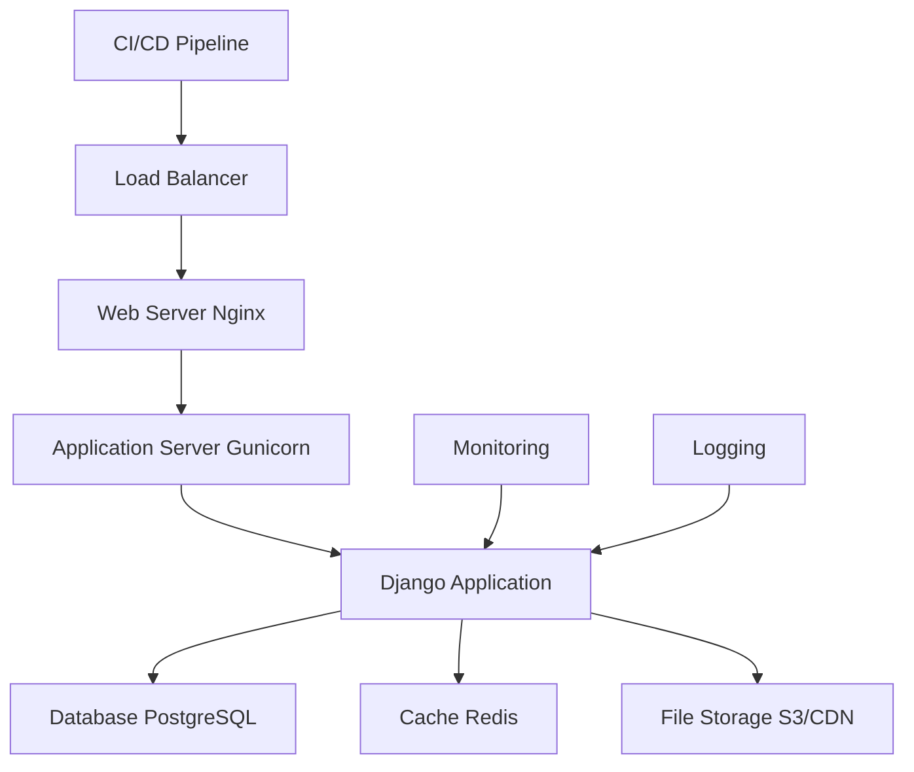

# Deployment Guide 🚀

This comprehensive guide covers deploying your Django REST Framework application to production environments. We'll cover various deployment strategies, from simple shared hosting to scalable cloud solutions.

## 📚 Table of Contents

1. [🏗️ Overview](#️-overview)
2. [🔧 Pre-deployment Checklist](#-pre-deployment-checklist)
3. [🌍 Environment Configuration](#-environment-configuration)
4. [📦 Application Deployment](#-application-deployment)
5. [🗄️ Database Setup](#️-database-setup)
6. [🌐 Web Server Configuration](#-web-server-configuration)
7. [☁️ Cloud Deployment](#️-cloud-deployment)
8. [🔒 Security Hardening](#-security-hardening)
9. [📊 Monitoring and Logging](#-monitoring-and-logging)
10. [🔄 Maintenance and Updates](#-maintenance-and-updates)

---

## 🏗️ Overview

### 🎯 Deployment Architecture

A typical production Django deployment consists of several components:



### 🏛️ Deployment Options

| Option | Complexity | Scalability | Cost | Best For |
|--------|------------|-------------|------|----------|
| **Shared Hosting** | Low | Low | $ | Small projects, learning |
| **VPS/Dedicated** | Medium | Medium | $$ | Medium projects, custom control |
| **PaaS (Heroku)** | Low | High | $$$ | Rapid deployment, scaling |
| **Cloud (AWS/Azure/GCP)** | High | Very High | $$$$ | Large-scale, enterprise |
| **Container (Docker)** | Medium | High | $$ | Consistent environments |

---

## 🔧 Pre-deployment Checklist

### ✅ Application Preparation

#### **1. Code Review**
```bash
# Run all tests
python manage.py test

# Check code quality
flake8 .
black --check .
isort --check-only .

# Check for security issues
pip install bandit
bandit -r .

# Check for outdated dependencies
pip list --outdated
```

#### **2. Settings Configuration**
```python
# core/settings.py
import os
from decouple import config

# Security settings
DEBUG = config('DEBUG', default=False, cast=bool)
ALLOWED_HOSTS = config('ALLOWED_HOSTS', default='').split(',')

# Security middleware
MIDDLEWARE = [
    'corsheaders.middleware.CorsMiddleware',
    'django.middleware.security.SecurityMiddleware',
    'whitenoise.middleware.WhiteNoiseMiddleware',
    # ... other middleware
]

# HTTPS settings
SECURE_SSL_REDIRECT = config('SECURE_SSL_REDIRECT', default=True, cast=bool)
SECURE_HSTS_SECONDS = config('SECURE_HSTS_SECONDS', default=31536000, cast=int)
SECURE_HSTS_INCLUDE_SUBDOMAINS = True
SECURE_HSTS_PRELOAD = True

# Session and cookie security
SESSION_COOKIE_SECURE = True
CSRF_COOKIE_SECURE = True
SESSION_COOKIE_HTTPONLY = True
CSRF_COOKIE_HTTPONLY = True

# Database settings (production)
DATABASES = {
    'default': {
        'ENGINE': 'django.db.backends.postgresql',
        'NAME': config('DB_NAME'),
        'USER': config('DB_USER'),
        'PASSWORD': config('DB_PASSWORD'),
        'HOST': config('DB_HOST', default='localhost'),
        'PORT': config('DB_PORT', default='5432'),
        'OPTIONS': {
            'sslmode': 'require',
        }
    }
}

# Static files
STATIC_ROOT = BASE_DIR / 'staticfiles'
STATIC_URL = '/static/'

# Media files
MEDIA_ROOT = BASE_DIR / 'media'
MEDIA_URL = '/media/'

# Logging
LOGGING = {
    'version': 1,
    'disable_existing_loggers': False,
    'formatters': {
        'verbose': {
            'format': '{levelname} {asctime} {module} {process:d} {thread:d} {message}',
            'style': '{',
        },
    },
    'handlers': {
        'file': {
            'level': 'INFO',
            'class': 'logging.handlers.RotatingFileHandler',
            'filename': '/var/log/django/django.log',
            'maxBytes': 1024*1024*10,  # 10MB
            'backupCount': 5,
            'formatter': 'verbose',
        },
        'error_file': {
            'level': 'ERROR',
            'class': 'logging.handlers.RotatingFileHandler',
            'filename': '/var/log/django/django_error.log',
            'maxBytes': 1024*1024*10,
            'backupCount': 5,
            'formatter': 'verbose',
        },
    },
    'loggers': {
        'django': {
            'handlers': ['file', 'error_file'],
            'level': 'INFO',
            'propagate': False,
        },
        'users': {
            'handlers': ['file', 'error_file'],
            'level': 'INFO',
            'propagate': False,
        },
        'tasks': {
            'handlers': ['file', 'error_file'],
            'level': 'INFO',
            'propagate': False,
        },
    },
}
```

#### **3. Environment Variables**
```bash
# Production .env file
DEBUG=False
SECRET_KEY=your-super-secret-production-key
ALLOWED_HOSTS=yourdomain.com,www.yourdomain.com

# Database
DB_NAME=your_production_db
DB_USER=your_db_user
DB_PASSWORD=your_secure_db_password
DB_HOST=your-db-host.com
DB_PORT=5432

# Email
EMAIL_BACKEND=django.core.mail.backends.smtp.EmailBackend
EMAIL_HOST=smtp.gmail.com
EMAIL_PORT=587
EMAIL_USE_TLS=True
EMAIL_HOST_USER=your-email@gmail.com
EMAIL_HOST_PASSWORD=your-app-password

# Security
SECURE_SSL_REDIRECT=True
SECURE_HSTS_SECONDS=31536000

# Redis (if using)
REDIS_URL=redis://your-redis-host:6379/0

# AWS (if using S3)
AWS_ACCESS_KEY_ID=your-aws-access-key
AWS_SECRET_ACCESS_KEY=your-aws-secret-key
AWS_STORAGE_BUCKET_NAME=your-s3-bucket
```

#### **4. Collect Static Files**
```bash
# Collect static files
python manage.py collectstatic --noinput

# Verify static files
ls -la staticfiles/
```

### 🗄️ Database Preparation

#### **1. Database Migration**
```bash
# Create and apply migrations
python manage.py makemigrations
python manage.py migrate

# Create superuser
python manage.py createsuperuser

# Load initial data (if any)
python manage.py loaddata fixtures/initial_data.json
```

#### **2. Database Backup**
```bash
# PostgreSQL backup
pg_dump -h localhost -U username -d dbname > backup.sql

# Compress backup
gzip backup.sql

# Verify backup
zcat backup.sql.gz | head
```

---

## 🌍 Environment Configuration

### 🏗️ Production Server Setup

#### **1. System Requirements**
```bash
# Update system packages
sudo apt update && sudo apt upgrade -y

# Install required packages
sudo apt install -y \
    python3.11 \
    python3.11-pip \
    python3.11-venv \
    python3.11-dev \
    postgresql-15 \
    postgresql-contrib \
    nginx \
    redis-server \
    supervisor \
    git \
    curl \
    wget
```

#### **2. Create Application User**
```bash
# Create system user for the application
sudo adduser deploy

# Add user to sudo group (if needed)
sudo usermod -aG sudo deploy

# Switch to deploy user
sudo su - deploy
```

#### **3. Set Up Project Directory**
```bash
# Create project directory
mkdir -p /var/www/drf_boilerplate
cd /var/www/drf_boilerplate

# Clone repository
git clone https://github.com/your-username/drf_boilerplate.git .

# Create virtual environment
python3.11 -m venv venv
source venv/bin/activate

# Install dependencies
pip install --upgrade pip
pip install -r requirements.txt
pip install gunicorn psycopg2-binary
```

---

## 📦 Application Deployment

### 🔧 Gunicorn Configuration

#### **1. Create Gunicorn Configuration**
```bash
# Create gunicorn config directory
mkdir -p /var/www/drf_boilerplate/config

# Create gunicorn config file
cat > /var/www/drf_boilerplate/config/gunicorn.conf.py << EOF
import multiprocessing

# Server socket
bind = "unix:/var/www/drf_boilerplate/gunicorn.sock"
backlog = 2048

# Worker processes
workers = multiprocessing.cpu_count() * 2 + 1
worker_class = "sync"
worker_connections = 1000
timeout = 30
keepalive = 2

# Logging
accesslog = "/var/log/gunicorn/access.log"
errorlog = "/var/log/gunicorn/error.log"
loglevel = "info"
access_log_format = '%(h)s %(l)s %(u)s %(t)s "%(r)s" %(s)s %(b)s "%(f)s" "%(a)s" %(D)s'

# Process naming
proc_name = "drf_boilerplate"

# Server mechanics
daemon = False
pidfile = "/var/run/gunicorn/drf_boilerplate.pid"
user = "deploy"
group = "deploy"
tmp_upload_dir = None

# SSL
keyfile = None
certfile = None

# Security
limit_request_line = 4094
limit_request_fields = 100
limit_request_field_size = 8190
EOF
```

#### **2. Create Gunicorn Service**
```bash
# Create gunicorn service file
sudo tee /etc/systemd/system/gunicorn.service << EOF
[Unit]
Description=gunicorn daemon for drf_boilerplate
After=network.target

[Service]
Type=notify
User=deploy
Group=deploy
RuntimeDirectory=gunicorn
WorkingDirectory=/var/www/drf_boilerplate
Environment=PATH=/var/www/drf_boilerplate/venv/bin
EnvironmentFile=/var/www/drf_boilerplate/.env
ExecStart=/var/www/drf_boilerplate/venv/bin/gunicorn --config config/gunicorn.conf.py core.wsgi:application
ExecReload=/bin/kill -s HUP \$MAINPID
KillMode=mixed
TimeoutStopSec=5
PrivateTmp=true
Restart=on-failure
RestartSec=5

[Install]
WantedBy=multi-user.target
EOF

# Enable and start gunicorn service
sudo systemctl daemon-reload
sudo systemctl enable gunicorn
sudo systemctl start gunicorn
sudo systemctl status gunicorn
```

### 🔄 Supervisor Alternative

#### **Supervisor Configuration**
```bash
# Create supervisor config
sudo tee /etc/supervisor/conf.d/drf_boilerplate.conf << EOF
[program:drf_boilerplate]
command=/var/www/drf_boilerplate/venv/bin/gunicorn --config config/gunicorn.conf.py core.wsgi:application
directory=/var/www/drf_boilerplate
user=deploy
autostart=true
autorestart=true
redirect_stderr=true
stdout_logfile=/var/log/supervisor/drf_boilerplate.log
environment=PATH="/var/www/drf_boilerplate/venv/bin"
EOF

# Update supervisor and start
sudo supervisorctl reread
sudo supervisorctl update
sudo supervisorctl start drf_boilerplate
```

---

## 🗄️ Database Setup

### 🐘 PostgreSQL Configuration

#### **1. Install PostgreSQL**
```bash
# Install PostgreSQL
sudo apt install postgresql postgresql-contrib

# Start PostgreSQL
sudo systemctl start postgresql
sudo systemctl enable postgresql
```

#### **2. Create Database and User**
```bash
# Switch to postgres user
sudo -u postgres psql

# In PostgreSQL shell
CREATE DATABASE drf_boilerplate_prod;
CREATE USER drf_user WITH PASSWORD 'your_secure_password';
ALTER ROLE drf_user SET client_encoding TO 'utf8';
ALTER ROLE drf_user SET default_transaction_isolation TO 'read committed';
ALTER ROLE drf_user SET timezone TO 'UTC';
GRANT ALL PRIVILEGES ON DATABASE drf_boilerplate_prod TO drf_user;
\q
```

#### **3. Configure PostgreSQL**
```bash
# Edit PostgreSQL configuration
sudo nano /etc/postgresql/15/main/postgresql.conf

# Set these parameters
listen_addresses = 'localhost'
max_connections = 100
shared_buffers = 256MB
effective_cache_size = 1GB

# Edit pg_hba.conf
sudo nano /etc/postgresql/15/main/pg_hba.conf

# Add this line (replace with your password)
local   drf_boilerplate_prod   drf_user   md5

# Restart PostgreSQL
sudo systemctl restart postgresql
```

#### **4. Database Backup Strategy**
```bash
# Create backup script
cat > /var/www/drf_boilerplate/scripts/backup_db.sh << EOF
#!/bin/bash

# Backup database
BACKUP_DIR="/var/backups/drf_boilerplate"
DATE=\$(date +%Y%m%d_%H%M%S)
DB_NAME="drf_boilerplate_prod"
DB_USER="drf_user"

# Create backup directory
mkdir -p \$BACKUP_DIR

# Create backup
pg_dump -h localhost -U \$DB_USER -d \$DB_NAME | gzip > \$BACKUP_DIR/backup_\$DATE.sql.gz

# Remove old backups (keep last 7 days)
find \$BACKUP_DIR -name "backup_*.sql.gz" -mtime +7 -delete

echo "Backup completed: \$BACKUP_DIR/backup_\$DATE.sql.gz"
EOF

# Make script executable
chmod +x /var/www/drf_boilerplate/scripts/backup_db.sh

# Add to crontab (daily at 2 AM)
crontab -e
# Add: 0 2 * * * /var/www/drf_boilerplate/scripts/backup_db.sh
```

---

## 🌐 Web Server Configuration

### 🌍 Nginx Configuration

#### **1. Install Nginx**
```bash
# Install Nginx
sudo apt install nginx

# Start and enable Nginx
sudo systemctl start nginx
sudo systemctl enable nginx
```

#### **2. Create Nginx Configuration**
```bash
# Create site configuration
sudo tee /etc/nginx/sites-available/drf_boilerplate << EOF
server {
    listen 80;
    server_name yourdomain.com www.yourdomain.com;
    return 301 https://\$server_name\$request_uri;
}

server {
    listen 443 ssl http2;
    server_name yourdomain.com www.yourdomain.com;

    # SSL Configuration
    ssl_certificate /etc/letsencrypt/live/yourdomain.com/fullchain.pem;
    ssl_certificate_key /etc/letsencrypt/live/yourdomain.com/privkey.pem;
    ssl_protocols TLSv1.2 TLSv1.3;
    ssl_ciphers ECDHE-RSA-AES256-GCM-SHA512:DHE-RSA-AES256-GCM-SHA512:ECDHE-RSA-AES256-GCM-SHA384:DHE-RSA-AES256-GCM-SHA384;
    ssl_prefer_server_ciphers off;
    ssl_session_cache shared:SSL:10m;
    ssl_session_timeout 10m;

    # Security Headers
    add_header X-Frame-Options "SAMEORIGIN" always;
    add_header X-XSS-Protection "1; mode=block" always;
    add_header X-Content-Type-Options "nosniff" always;
    add_header Referrer-Policy "no-referrer-when-downgrade" always;
    add_header Content-Security-Policy "default-src 'self' http: https: data: blob: 'unsafe-inline'" always;
    add_header Strict-Transport-Security "max-age=31536000; includeSubDomains" always;

    # Django App
    location / {
        include proxy_params;
        proxy_pass http://unix:/var/www/drf_boilerplate/gunicorn.sock;
        proxy_connect_timeout 60s;
        proxy_send_timeout 60s;
        proxy_read_timeout 60s;
    }

    # Static Files
    location /static/ {
        alias /var/www/drf_boilerplate/staticfiles/;
        expires 1y;
        add_header Cache-Control "public, immutable";
    }

    # Media Files
    location /media/ {
        alias /var/www/drf_boilerplate/media/;
        expires 1y;
        add_header Cache-Control "public";
    }

    # Admin
    location /admin/ {
        include proxy_params;
        proxy_pass http://unix:/var/www/drf_boilerplate/gunicorn.sock;
    }

    # Django API
    location /api/ {
        include proxy_params;
        proxy_pass http://unix:/var/www/drf_boilerplate/gunicorn.sock;
    }

    # Health Check
    location /health/ {
        access_log off;
        return 200 "healthy\n";
        add_header Content-Type text/plain;
    }

    # Error pages
    error_page 404 /404.html;
    error_page 500 502 503 504 /50x.html;
    location = /50x.html {
        root /usr/share/nginx/html;
    }
}
EOF

# Enable site
sudo ln -s /etc/nginx/sites-available/drf_boilerplate /etc/nginx/sites-enabled/

# Remove default site
sudo rm /etc/nginx/sites-enabled/default

# Test configuration
sudo nginx -t

# Restart Nginx
sudo systemctl restart nginx
```

#### **3. SSL Certificate with Let's Encrypt**
```bash
# Install Certbot
sudo apt install certbot python3-certbot-nginx

# Obtain SSL certificate
sudo certbot --nginx -d yourdomain.com -d www.yourdomain.com

# Set up auto-renewal
sudo crontab -e
# Add: 0 12 * * * /usr/bin/certbot renew --quiet
```

---

## ☁️ Cloud Deployment

### 🐳 Docker Deployment

#### **1. Multi-stage Dockerfile**
```dockerfile
# Dockerfile
FROM python:3.11-slim as builder

# Set environment variables
ENV PYTHONDONTWRITEBYTECODE=1
ENV PYTHONUNBUFFERED=1

# Install system dependencies
RUN apt-get update \
    && apt-get install -y --no-install-recommends \
        build-essential \
        libpq-dev \
    && rm -rf /var/lib/apt/lists/*

# Install Python dependencies
COPY requirements.txt .
RUN pip wheel --no-cache-dir --no-deps --wheel-dir /tmp/wheels -r requirements.txt

# Production stage
FROM python:3.11-slim

# Set environment variables
ENV PYTHONDONTWRITEBYTECODE=1
ENV PYTHONUNBUFFERED=1

# Install system dependencies
RUN apt-get update \
    && apt-get install -y --no-install-recommends \
        libpq5 \
    && rm -rf /var/lib/apt/lists/*

# Create non-root user
RUN groupadd -r django && useradd -r -g django django

# Install Python dependencies
COPY --from=builder /tmp/wheels /wheels
RUN pip install --no-cache /wheels/*

# Create necessary directories
RUN mkdir -p /var/www/drf_boilerplate/staticfiles /var/www/drf_boilerplate/media /var/www/drf_boilerplate/logs

# Copy project
COPY . /var/www/drf_boilerplate/
WORKDIR /var/www/drf_boilerplate

# Change ownership
RUN chown -R django:django /var/www/drf_boilerplate

# Switch to non-root user
USER django

# Collect static files
RUN python manage.py collectstatic --noinput

# Health check
HEALTHCHECK --interval=30s --timeout=30s --start-period=5s --retries=3 \
    CMD curl -f http://localhost:8000/health/ || exit 1

# Expose port
EXPOSE 8000

# Start command
CMD ["gunicorn", "--bind", "0.0.0.0:8000", "--workers", "3", "core.wsgi:application"]
```

#### **2. Docker Compose**
```yaml
# docker-compose.prod.yml
version: '3.8'

services:
  web:
    build: .
    ports:
      - "8000:8000"
    environment:
      - DEBUG=False
      - DB_HOST=db
      - REDIS_URL=redis://redis:6379/0
    depends_on:
      - db
      - redis
    volumes:
      - static_volume:/var/www/drf_boilerplate/staticfiles
      - media_volume:/var/www/drf_boilerplate/media
    restart: unless-stopped

  db:
    image: postgres:15
    environment:
      - POSTGRES_DB=drf_boilerplate_prod
      - POSTGRES_USER=drf_user
      - POSTGRES_PASSWORD=your_secure_password
    volumes:
      - postgres_data:/var/lib/postgresql/data
    restart: unless-stopped

  redis:
    image: redis:7-alpine
    restart: unless-stopped

  nginx:
    image: nginx:alpine
    ports:
      - "80:80"
      - "443:443"
    volumes:
      - ./nginx.conf:/etc/nginx/nginx.conf
      - static_volume:/var/www/drf_boilerplate/staticfiles
      - media_volume:/var/www/drf_boilerplate/media
      - ./ssl:/etc/ssl/certs
    depends_on:
      - web
    restart: unless-stopped

volumes:
  postgres_data:
  static_volume:
  media_volume:
```

### ☁️ Heroku Deployment

#### **1. Heroku Setup**
```bash
# Install Heroku CLI
# macOS
brew tap heroku/brew && brew install heroku

# Ubuntu
sudo snap install --classic heroku

# Login to Heroku
heroku login

# Create Heroku app
heroku create your-app-name

# Set environment variables
heroku config:set DEBUG=False
heroku config:set SECRET_KEY=your-secret-key
heroku config:set DJANGO_SETTINGS_MODULE=core.settings.heroku
```

#### **2. Heroku Configuration Files**

**Procfile:**
```procfile
web: gunicorn core.wsgi:application --bind 0.0.0.0:$PORT
worker: python manage.py rqworker
```

**runtime.txt:**
```
python-3.11.5
```

**requirements.txt:**
```
Django==5.2.7
djangorestframework==3.16.1
gunicorn==23.0.0
psycopg2-binary==2.9.9
django-heroku==0.3.1
```

**core/settings/heroku.py:**
```python
from .base import *
import django_heroku

# Disable debug
DEBUG = False

# Configure Heroku
django_heroku.settings(locals())

# Static files configuration
import os
BASE_DIR = os.path.dirname(os.path.dirname(os.path.abspath(__file__)))

STATIC_ROOT = os.path.join(BASE_DIR, 'staticfiles')
STATIC_URL = '/static/'

# Database configuration (Heroku PostgreSQL)
import dj_database_url
DATABASES['default'] = dj_database_url.config(conn_max_age=600, ssl_require=True)
```

#### **3. Deploy to Heroku**
```bash
# Add Heroku remote
heroku git:remote -a your-app-name

# Deploy
git add .
git commit -m "Deploy to Heroku"
git push heroku main

# Run migrations
heroku run python manage.py migrate

# Create superuser
heroku run python manage.py createsuperuser

# Open app
heroku open
```

### ☁️ AWS EC2 Deployment

#### **1. EC2 Instance Setup**
```bash
# Launch EC2 instance (Ubuntu 22.04)
# Configure security groups:
# - SSH (port 22)
# - HTTP (port 80)
# - HTTPS (port 443)

# Connect to instance
ssh -i your-key.pem ubuntu@your-ec2-ip

# Update system
sudo apt update && sudo apt upgrade -y
```

#### **2. AWS CLI Configuration**
```bash
# Install AWS CLI
curl "https://awscli.amazonaws.com/awscli-exe-linux-x86_64.zip" -o "awscliv2.zip"
unzip awscliv2.zip
sudo ./aws/install

# Configure AWS CLI
aws configure
```

#### **3. S3 for Static Files**
```python
# core/settings/base.py
if 'AWS_ACCESS_KEY_ID' in os.environ:
    # AWS S3 configuration
    AWS_ACCESS_KEY_ID = os.environ['AWS_ACCESS_KEY_ID']
    AWS_SECRET_ACCESS_KEY = os.environ['AWS_SECRET_ACCESS_KEY']
    AWS_STORAGE_BUCKET_NAME = os.environ['AWS_STORAGE_BUCKET_NAME']
    AWS_S3_CUSTOM_DOMAIN = f'{AWS_STORAGE_BUCKET_NAME}.s3.amazonaws.com'
    AWS_S3_OBJECT_PARAMETERS = {
        'CacheControl': 'max-age=86400',
    }
    AWS_LOCATION = 'static'
    STATIC_URL = f'https://{AWS_S3_CUSTOM_DOMAIN}/{AWS_LOCATION}/'
    STATICFILES_STORAGE = 'storages.backends.s3boto3.S3Boto3Storage'
    DEFAULT_FILE_STORAGE = 'storages.backends.s3boto3.S3Boto3Storage'
```

---

## 🔒 Security Hardening

### 🛡️ Security Checklist

#### **1. Application Security**
```python
# core/settings.py
# Enable all security middleware
MIDDLEWARE = [
    'corsheaders.middleware.CorsMiddleware',
    'django.middleware.security.SecurityMiddleware',
    'whitenoise.middleware.WhiteNoiseMiddleware',
    'django.contrib.sessions.middleware.SessionMiddleware',
    'django.middleware.common.CommonMiddleware',
    'django.middleware.csrf.CsrfViewMiddleware',
    'django.contrib.auth.middleware.AuthenticationMiddleware',
    'django.contrib.messages.middleware.MessageMiddleware',
    'django.middleware.clickjacking.XFrameOptionsMiddleware',
]

# Security settings
SECURE_CONTENT_TYPE_NOSNIFF = True
SECURE_BROWSER_XSS_FILTER = True
SECURE_SSL_REDIRECT = True
SECURE_HSTS_SECONDS = 31536000
SECURE_HSTS_INCLUDE_SUBDOMAINS = True
SECURE_HSTS_PRELOAD = True
X_FRAME_OPTIONS = 'DENY'
```

#### **2. Server Security**
```bash
# Configure firewall
sudo ufw allow ssh
sudo ufw allow 'Nginx Full'
sudo ufw enable

# Disable root login
sudo nano /etc/ssh/sshd_config
# Set: PermitRootLogin no
# Set: PasswordAuthentication no

# Restart SSH
sudo systemctl restart ssh

# Install fail2ban
sudo apt install fail2ban
sudo systemctl enable fail2ban
sudo systemctl start fail2ban
```

#### **3. Database Security**
```sql
-- Secure PostgreSQL
-- Use strong passwords
-- Enable SSL connections
-- Regular backups
-- Limited user permissions
```

#### **4. Environment Security**
```bash
# Secure environment files
chmod 600 .env
chown deploy:deploy .env

# Use secrets management service for production
# AWS Secrets Manager, HashiCorp Vault, etc.
```

---

## 📊 Monitoring and Logging

### 📈 Monitoring Setup

#### **1. Application Monitoring**
```python
# Install django-prometheus
pip install django-prometheus

# Add to settings
INSTALLED_APPS += ['django_prometheus']

# Add to urls
urlpatterns += [
    path('', include('django_prometheus.urls')),
]

# Configure metrics
PROMETHEUS_EXPORT_MIGRATIONS = True
```

#### **2. System Monitoring with Prometheus**
```yaml
# prometheus.yml
global:
  scrape_interval: 15s

scrape_configs:
  - job_name: 'django'
    static_configs:
      - targets: ['localhost:8000']
    metrics_path: '/metrics'
    scrape_interval: 5s

  - job_name: 'nginx'
    static_configs:
      - targets: ['localhost:9113']

  - job_name: 'postgres'
    static_configs:
      - targets: ['localhost:9187']

  - job_name: 'node'
    static_configs:
      - targets: ['localhost:9100']
```

#### **3. Grafana Dashboard**
```bash
# Install Grafana
sudo apt install grafana

# Start Grafana
sudo systemctl start grafana
sudo systemctl enable grafana

# Access at http://your-server:3000
# Default credentials: admin/admin
```

### 📊 Logging Strategy

#### **1. Centralized Logging**
```python
# core/settings.py
LOGGING = {
    'version': 1,
    'disable_existing_loggers': False,
    'formatters': {
        'json': {
            'format': '{"level": "%(levelname)s", "time": "%(asctime)s", "message": "%(message)s", "module": "%(module)s"}',
        },
    },
    'handlers': {
        'console': {
            'class': 'logging.StreamHandler',
            'formatter': 'json',
        },
        'file': {
            'class': 'logging.handlers.RotatingFileHandler',
            'filename': '/var/log/django/django.log',
            'maxBytes': 1024*1024*10,
            'backupCount': 5,
            'formatter': 'json',
        },
    },
    'root': {
        'handlers': ['console', 'file'],
        'level': 'INFO',
    },
}
```

#### **2. ELK Stack Setup**
```yaml
# docker-compose.logging.yml
version: '3.8'

services:
  elasticsearch:
    image: docker.elastic.co/elasticsearch/elasticsearch:8.5.0
    environment:
      - discovery.type=single-node
      - xpack.security.enabled=false
    ports:
      - "9200:9200"
    volumes:
      - elasticsearch_data:/usr/share/elasticsearch/data

  logstash:
    image: docker.elastic.co/logstash/logstash:8.5.0
    ports:
      - "5044:5044"
    volumes:
      - ./logstash.conf:/usr/share/logstash/pipeline/logstash.conf
    depends_on:
      - elasticsearch

  kibana:
    image: docker.elastic.co/kibana/kibana:8.5.0
    ports:
      - "5601:5601"
    environment:
      - ELASTICSEARCH_HOSTS=http://elasticsearch:9200
    depends_on:
      - elasticsearch

volumes:
  elasticsearch_data:
```

---

## 🔄 Maintenance and Updates

### 🔄 Deployment Pipeline

#### **1. Automated Deployment Script**
```bash
#!/bin/bash
# deploy.sh

set -e

echo "Starting deployment..."

# Pull latest code
git pull origin main

# Activate virtual environment
source venv/bin/activate

# Install dependencies
pip install -r requirements.txt

# Run tests
python manage.py test

# Collect static files
python manage.py collectstatic --noinput

# Run migrations
python manage.py migrate

# Restart application
sudo systemctl restart gunicorn
sudo systemctl restart nginx

echo "Deployment completed successfully!"
```

#### **2. CI/CD with GitHub Actions**
```yaml
# .github/workflows/deploy.yml
name: Deploy to Production

on:
  push:
    branches: [ main ]

jobs:
  deploy:
    runs-on: ubuntu-latest

    steps:
    - uses: actions/checkout@v3

    - name: Set up Python
      uses: actions/setup-python@v4
      with:
        python-version: '3.11'

    - name: Install dependencies
      run: |
        pip install -r requirements.txt

    - name: Run tests
      run: |
        python manage.py test

    - name: Deploy to server
      uses: appleboy/ssh-action@v0.1.5
      with:
        host: ${{ secrets.HOST }}
        username: ${{ secrets.USERNAME }}
        key: ${{ secrets.SSH_KEY }}
        script: |
          cd /var/www/drf_boilerplate
          git pull origin main
          source venv/bin/activate
          pip install -r requirements.txt
          python manage.py collectstatic --noinput
          python manage.py migrate
          sudo systemctl restart gunicorn
          sudo systemctl restart nginx
```

### 🔄 Update Strategy

#### **1. Zero-Downtime Deployment**
```bash
# Blue-green deployment approach
#!/bin/bash

# Create new release directory
RELEASE_DIR="/var/www/drf_boilerplate/releases/$(date +%Y%m%d_%H%M%S)"
git clone https://github.com/your-username/drf_boilerplate.git $RELEASE_DIR
cd $RELEASE_DIR

# Setup and test
source venv/bin/activate
pip install -r requirements.txt
python manage.py test
python manage.py collectstatic --noinput

# Switch symbolic link
ln -sfn $RELEASE_DIR /var/www/drf_boilerplate/current

# Restart services
sudo systemctl restart gunicorn

# Clean old releases
find /var/www/drf_boilerplate/releases -maxdepth 1 -type d -mtime +7 -exec rm -rf {} \;
```

#### **2. Database Migration Strategy**
```python
# Create data migrations carefully
# Always test migrations on staging first
# Use --fake-initial for initial migrations
# Plan for rollback scenarios
```

---

## 🎉 Summary

This comprehensive deployment guide covers everything you need to successfully deploy your Django REST Framework application to production:

### ✅ Key Components Covered

- **🔧 Pre-deployment Checklist**: Code review, testing, security checks
- **🌍 Environment Configuration**: Production settings and security
- **📦 Application Deployment**: Gunicorn, Supervisor, and process management
- **🗄️ Database Setup**: PostgreSQL configuration and backup strategies
- **🌐 Web Server Configuration**: Nginx setup with SSL and security headers
- **☁️ Cloud Deployment**: Docker, Heroku, AWS deployment options
- **🔒 Security Hardening**: Multi-layer security approach
- **📊 Monitoring and Logging**: Comprehensive monitoring setup
- **🔄 Maintenance and Updates**: Automated deployment and CI/CD

### 🎯 Best Practices

1. **Security First**: Always prioritize security in production
2. **Automate Everything**: Use CI/CD pipelines for reliable deployments
3. **Monitor Everything**: Implement comprehensive logging and monitoring
4. **Backup Regularly**: Regular database and file backups
5. **Test Thoroughly**: Test in staging before production deployment
6. **Plan for Rollback**: Always have a rollback strategy
7. **Document Everything**: Maintain clear deployment documentation

### 🚀 Next Steps

1. **Choose Your Platform**: Select the deployment platform that fits your needs
2. **Set Up Monitoring**: Implement monitoring and alerting
3. **Optimize Performance**: Profile and optimize your application
4. **Scale as Needed**: Plan for horizontal scaling
5. **Regular Maintenance**: Keep dependencies updated and secure

Happy deploying! 🚀

---

## 🆘 Troubleshooting

### 🔧 Common Deployment Issues

#### **Application Won't Start**
```bash
# Check logs
sudo journalctl -u gunicorn -f
sudo tail -f /var/log/nginx/error.log
sudo tail -f /var/log/gunicorn/error.log

# Check configuration
python manage.py check --deploy

# Check permissions
ls -la /var/www/drf_boilerplate/
```

#### **Database Connection Issues**
```bash
# Test database connection
python manage.py dbshell

# Check PostgreSQL status
sudo systemctl status postgresql

# Check database logs
sudo tail -f /var/log/postgresql/postgresql-15-main.log
```

#### **Static Files Not Loading**
```bash
# Check static files
python manage.py collectstatic --noinput
ls -la staticfiles/

# Check Nginx configuration
sudo nginx -t

# Check file permissions
sudo chown -R www-data:www-data staticfiles/
```

For additional support, refer to the official Django and Django REST Framework documentation or open an issue in the project repository.