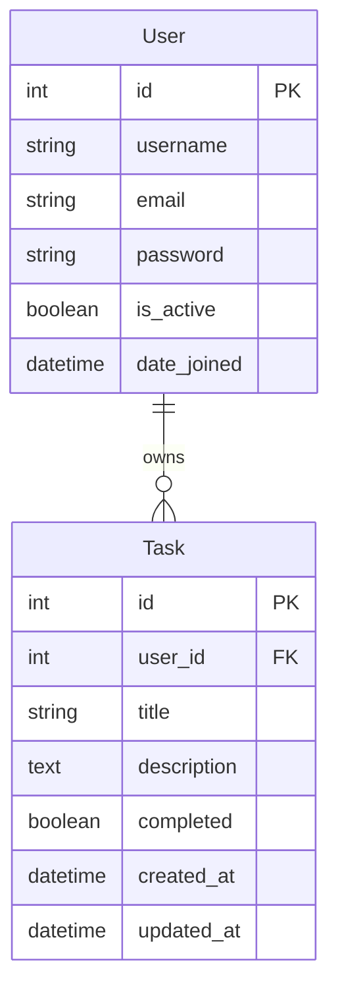

# Models and Database Structure 📊

In this comprehensive guide, we'll explore the database models and data structure of our Django REST Framework boilerplate project. Understanding the models is crucial as they form the foundation of your API.

## 📚 Table of Contents

1. [🏗️ Overview](#️-overview)
2. [👥 User Model](#-user-model)
3. [📋 Task Model](#-task-model)
4. [🔗 Database Relationships](#-database-relationships)
5. [🏛️ Model Fields Explained](#️-model-fields-explained)
6. [🔄 Migrations](#-migrations)
7. [🛡️ Database Constraints](#️-database-constraints)
8. [🔍 Querying and Filtering](#-querying-and-filtering)
9. [⚙️ Model Admin Configuration](#️-model-admin-configuration)
10. [🧪 Testing Models](#-testing-models)

---

## 🏗️ Overview

Our Django application uses two main models:

1. **User Model** - Leveraging Django's built-in `User` model for authentication
2. **Task Model** - Custom model for task management functionality

The database follows these design principles:
- **Normalization**: Proper relationships between data
- **Security**: User isolation and data protection
- **Performance**: Efficient queries and indexes
- **Scalability**: Structure that can grow with application needs

---

## 👥 User Model

### 🔧 Django's Built-in User Model

We leverage Django's built-in `User` model from `django.contrib.auth.models` which provides a robust, secure foundation for user management.

```python
from django.contrib.auth.models import User

# The built-in User model includes:
# - id (AutoField, Primary Key)
# - username (CharField, unique)
# - email (EmailField)
# - first_name (CharField)
# - last_name (CharField)
# - password (CharField, hashed)
# - is_staff (BooleanField)
# - is_active (BooleanField)
# - is_superuser (BooleanField)
# - date_joined (DateTimeField)
# - last_login (DateTimeField)
```

### 🎯 Why Use Django's Built-in User Model?

1. **Security**: Password hashing, authentication mechanisms built-in
2. **Features**: Permissions, groups, admin integration
3. **Testing**: Well-tested and maintained by Django team
4. **Compatibility**: Works seamlessly with Django's auth system
5. **Extensibility**: Can be extended with profiles or custom fields

### 📊 User Model Schema

```sql
-- Simplified User table structure
CREATE TABLE auth_user (
    id INTEGER PRIMARY KEY AUTOINCREMENT,
    username VARCHAR(150) UNIQUE NOT NULL,
    email VARCHAR(254),
    first_name VARCHAR(150),
    last_name VARCHAR(150),
    password VARCHAR(128) NOT NULL,
    is_staff BOOLEAN NOT NULL DEFAULT FALSE,
    is_active BOOLEAN NOT NULL DEFAULT TRUE,
    is_superuser BOOLEAN NOT NULL DEFAULT FALSE,
    date_joined DATETIME NOT NULL,
    last_login DATETIME
);
```

---

## 📋 Task Model

### 🏗️ Task Model Definition

Our custom Task model is defined in [`tasks/models.py`](../tasks/models.py):

```python
from django.db import models
from django.contrib.auth.models import User

class Task(models.Model):
    """
    Task model for managing user-specific tasks.
    Each task belongs to a user and can be marked as completed.
    """
    user = models.ForeignKey(
        User,
        on_delete=models.CASCADE,
        related_name='tasks'
    )
    title = models.CharField(max_length=255)
    description = models.TextField(blank=True)
    completed = models.BooleanField(default=False)
    created_at = models.DateTimeField(auto_now_add=True)
    updated_at = models.DateTimeField(auto_now=True)

    class Meta:
        ordering = ['-created_at']
        indexes = [
            models.Index(fields=['user', 'completed']),
            models.Index(fields=['created_at']),
        ]

    def __str__(self):
        return self.title
```

### 🔍 Field Breakdown

| Field | Type | Description | Constraints |
|-------|------|-------------|-------------|
| `id` | AutoField | Primary key (auto-generated) | Unique, Primary Key |
| `user` | ForeignKey | Owner of the task | Related to User, CASCADE delete |
| `title` | CharField | Task title | Max 255 characters, Required |
| `description` | TextField | Detailed task description | Optional, can be blank |
| `completed` | BooleanField | Task completion status | Default: False |
| `created_at` | DateTimeField | Creation timestamp | Auto-set on creation |
| `updated_at` | DateTimeField | Last update timestamp | Auto-set on save |

### 📊 Task Model Schema

```sql
-- Tasks table structure
CREATE TABLE tasks_task (
    id INTEGER PRIMARY KEY AUTOINCREMENT,
    user_id INTEGER NOT NULL,
    title VARCHAR(255) NOT NULL,
    description TEXT,
    completed BOOLEAN NOT NULL DEFAULT FALSE,
    created_at DATETIME NOT NULL,
    updated_at DATETIME NOT NULL,
    FOREIGN KEY (user_id) REFERENCES auth_user(id)
);

-- Indexes for performance
CREATE INDEX idx_tasks_user_completed ON tasks_task(user_id, completed);
CREATE INDEX idx_tasks_created_at ON tasks_task(created_at);
```

---

## 🔗 Database Relationships

### 🏗️ One-to-Many Relationship: User → Tasks

The core relationship in our application is one-to-many: **One User can have Many Tasks**.



### 🔗 Relationship Characteristics

1. **Foreign Key Constraint**: `Task.user` references `User.id`
2. **Cascade Delete**: When a user is deleted, all their tasks are also deleted
3. **Related Name**: `user.tasks` gives access to all tasks for a user
4. **User Isolation**: Users can only access their own tasks

### 💻 Using the Relationships

```python
# Get a user
user = User.objects.get(username='john_doe')

# Get all tasks for a user
tasks = user.tasks.all()

# Create a task for a user
task = Task.objects.create(
    user=user,
    title='New Task',
    description='Task description'
)

# Count tasks for a user
task_count = user.tasks.count()

# Get completed tasks for a user
completed_tasks = user.tasks.filter(completed=True)
```

---

## 🏛️ Model Fields Explained

### 📝 Field Types and Their Usage

#### 1. **AutoField** (`id`)
- **Purpose**: Primary key, auto-incrementing integer
- **Benefits**: Efficient indexing, unique identification
- **Usage**: Automatically added by Django

#### 2. **ForeignKey** (`user`)
- **Purpose**: Creates many-to-one relationship
- **Options**:
  - `on_delete=models.CASCADE`: Delete related objects when parent is deleted
  - `related_name='tasks'`: Allows reverse lookup from User to Task
- **Database Impact**: Creates foreign key constraint

#### 3. **CharField** (`title`)
- **Purpose**: Short text fields
- **Constraints**: `max_length=255` - maximum characters allowed
- **Validation**: Django validates maximum length at form level
- **Database**: `VARCHAR(255)` in SQL

#### 4. **TextField** (`description`)
- **Purpose**: Long text content
- **No length limit**: Can store large amounts of text
- **Storage**: Efficient for large text content
- **Database**: `TEXT` type in SQL

#### 5. **BooleanField** (`completed`)
- **Purpose**: True/False values
- **Default**: `default=False` sets initial value
- **Database**: Typically stored as `BOOLEAN` or `TINYINT(1)`

#### 6. **DateTimeField** (`created_at`, `updated_at`)
- **auto_now_add=True**: Set only on creation, never changes
- **auto_now=True**: Updated every time the model is saved
- **Timezone**: Django stores all datetimes in UTC by default

### 🎯 Field Options and Validation

```python
# Example of field validation
class Task(models.Model):
    title = models.CharField(
        max_length=255,
        validators=[  # Custom validators
            MinLengthValidator(3, "Title must be at least 3 characters"),
            RegexValidator(r'^[A-Za-z0-9\s]+$', "Title can only contain letters, numbers, and spaces")
        ]
    )

    description = models.TextField(
        blank=True,  # Allows empty values in forms
        null=True,   # Allows NULL values in database
    )
```

---

## 🔄 Migrations

### 📋 What are Migrations?

Migrations are Django's way of propagating changes you make to your models into your database schema. They're designed to be mostly automatic, but you'll need to know when to make migrations, when to run them, and the common problems you might run into.

### 🔄 Migration Workflow

```bash
# 1. Make migrations after changing models
python manage.py makemigrations

# 2. Apply migrations to database
python manage.py migrate

# 3. Show migration status
python manage.py showmigrations

# 4. See SQL that would be executed
python manage.py sqlmigrate app_name migration_name
```

### 📁 Migration Files Structure

```
tasks/
└── migrations/
    ├── 0001_initial.py          # Initial Task model creation
    ├── 0002_task_updated_at.py  # Example: Adding updated_at field
    ├── 0003_task_indexes.py     # Example: Adding performance indexes
    └── __init__.py
```

### 📝 Migration File Example

```python
# 0001_initial.py
from django.db import migrations, models
import django.db.models.deletion

class Migration(migrations.Migration):

    initial = True

    dependencies = [
        ('auth', '0012_alter_user_first_name_max_length'),
    ]

    operations = [
        migrations.CreateModel(
            name='Task',
            fields=[
                ('id', models.BigAutoField(auto_created=True, primary_key=True)),
                ('title', models.CharField(max_length=255)),
                ('description', models.TextField(blank=True)),
                ('completed', models.BooleanField(default=False)),
                ('created_at', models.DateTimeField(auto_now_add=True)),
                ('updated_at', models.DateTimeField(auto_now=True)),
                ('user', models.ForeignKey(
                    on_delete=django.db.models.deletion.CASCADE,
                    related_name='tasks',
                    to='auth.user'
                )),
            ],
            options={
                'ordering': ['-created_at'],
            },
        ),
    ]
```

---

## 🛡️ Database Constraints

### 🔒 Built-in Constraints

#### 1. **Primary Key Constraint**
```sql
-- Automatically added by Django
CONSTRAINT task_pk PRIMARY KEY (id)
```

#### 2. **Foreign Key Constraint**
```sql
-- Ensures referential integrity
CONSTRAINT task_user_fkey FOREIGN KEY (user_id) REFERENCES auth_user(id)
```

#### 3. **NOT NULL Constraints**
```sql
-- Required fields
title VARCHAR(255) NOT NULL,
completed BOOLEAN NOT NULL,
user_id INTEGER NOT NULL
```

### 🎯 Custom Constraints (Optional)

You can add custom constraints for additional validation:

```python
from django.db import models

class Task(models.Model):
    title = models.CharField(max_length=255)
    description = models.TextField(blank=True)
    completed = models.BooleanField(default=False)
    due_date = models.DateField(null=True, blank=True)

    class Meta:
        constraints = [
            # Ensure completed tasks can't have future due dates
            models.CheckConstraint(
                check=models.Q(
                    models.Q(completed=False) |
                    models.Q(completed=True, due_date__lte=models.functions.Now())
                ),
                name='completed_task_cannot_have_future_due_date'
            ),
            # Ensure title is not empty
            models.CheckConstraint(
                check=~models.Q(title=''),
                name='title_cannot_be_empty'
            )
        ]
```

---

## 🔍 Querying and Filtering

### 📊 Basic QuerySet Operations

```python
# Get all tasks
all_tasks = Task.objects.all()

# Get a specific task
task = Task.objects.get(id=1)

# Filter tasks
completed_tasks = Task.objects.filter(completed=True)
user_tasks = Task.objects.filter(user=request.user)

# Multiple filters
important_completed_tasks = Task.objects.filter(
    completed=True,
    user=request.user
)

# Exclude tasks
pending_tasks = Task.objects.exclude(completed=True)

# Order tasks
recent_tasks = Task.objects.order_by('-created_at')
alphabetical_tasks = Task.objects.order_by('title')
```

### 🔍 Advanced Querying

```python
from django.db.models import Q, Count, Avg
from datetime import datetime, timedelta

# Complex OR queries
tasks = Task.objects.filter(
    Q(title__icontains='urgent') | Q(description__icontains='important')
)

# Date range queries
today = datetime.now().date()
week_ago = today - timedelta(days=7)
recent_tasks = Task.objects.filter(created_at__gte=week_ago)

# Aggregation
from django.db.models import Count, Avg

# Count tasks per user
task_counts = User.objects.annotate(
    task_count=Count('tasks')
)

# Average tasks per user
avg_tasks = Task.objects.aggregate(
    avg_count=Avg('user__tasks__count')
)

# Subqueries
users_with_completed_tasks = User.objects.filter(
    tasks__completed=True
).distinct()
```

### 🚀 Performance Optimization

```python
# Select related for foreign keys
tasks_with_users = Task.objects.select_related('user')

# Prefetch related for reverse foreign keys
users_with_tasks = User.objects.prefetch_related('tasks')

# Only fetch needed fields
tasks_minimal = Task.objects.only('id', 'title', 'completed')

# Defer loading heavy fields
tasks_no_description = Task.objects.defer('description')

# Using indexes efficiently
# Ensure your queries use indexed fields
recent_tasks = Task.objects.filter(
    user=request.user,
    created_at__gte=datetime.now() - timedelta(days=30)
).select_related('user')
```

---

## ⚙️ Model Admin Configuration

### 🎛️ Django Admin Integration

Our Task model is fully integrated with Django's admin interface for easy data management.

```python
# tasks/admin.py
from django.contrib import admin
from .models import Task

@admin.register(Task)
class TaskAdmin(admin.ModelAdmin):
    # Display these fields in list view
    list_display = ('title', 'user', 'completed', 'created_at')

    # Add filters in sidebar
    list_filter = ('completed', 'created_at', 'user')

    # Add search functionality
    search_fields = ('title', 'description', 'user__username')

    # Default ordering
    ordering = ('-created_at',)

    # Pagination
    list_per_page = 25

    # Allow editing these fields directly in list view
    list_editable = ('completed',)

    # Organize fields in detail view
    fieldsets = (
        ('Basic Information', {
            'fields': ('title', 'description', 'completed')
        }),
        ('Timestamps', {
            'fields': ('created_at', 'updated_at'),
            'classes': ('collapse',)
        }),
        ('User Information', {
            'fields': ('user',)
        })
    )

    # Read-only fields
    readonly_fields = ('created_at', 'updated_at')

    # Custom actions
    actions = ['mark_completed', 'mark_pending']

    def mark_completed(self, request, queryset):
        queryset.update(completed=True)
    mark_completed.short_description = "Mark selected tasks as completed"

    def mark_pending(self, request, queryset):
        queryset.update(completed=False)
    mark_pending.short_description = "Mark selected tasks as pending"
```

### 🎯 Admin Features

1. **List Display**: Shows key fields in the admin list view
2. **Filters**: Sidebar filters for easy data filtering
3. **Search**: Full-text search across multiple fields
4. **Inline Editing**: Edit completed status directly in list view
5. **Fieldsets**: Organized fields in detail view
6. **Actions**: Bulk operations on selected items
7. **Timestamps**: Automatic tracking of creation and updates

---

## 🧪 Testing Models

### 🧪 Writing Model Tests

Comprehensive testing ensures your models work as expected:

```python
# tasks/tests.py
from django.test import TestCase
from django.contrib.auth.models import User
from django.core.exceptions import ValidationError
from datetime import datetime, timedelta
from .models import Task

class TaskModelTest(TestCase):

    def setUp(self):
        """Set up test data"""
        self.user = User.objects.create_user(
            username='testuser',
            email='test@example.com',
            password='testpass123'
        )

    def test_task_creation(self):
        """Test creating a basic task"""
        task = Task.objects.create(
            user=self.user,
            title='Test Task',
            description='Test Description'
        )

        self.assertEqual(task.title, 'Test Task')
        self.assertEqual(task.description, 'Test Description')
        self.assertEqual(task.user, self.user)
        self.assertFalse(task.completed)
        self.assertIsNotNone(task.created_at)
        self.assertIsNotNone(task.updated_at)

    def test_task_str_representation(self):
        """Test the string representation of Task"""
        task = Task.objects.create(
            user=self.user,
            title='Test Task'
        )
        self.assertEqual(str(task), 'Test Task')

    def test_task_ordering(self):
        """Test that tasks are ordered by creation date (newest first)"""
        task1 = Task.objects.create(user=self.user, title='Task 1')
        task2 = Task.objects.create(user=self.user, title='Task 2')
        task3 = Task.objects.create(user=self.user, title='Task 3')

        tasks = list(Task.objects.all())
        self.assertEqual(tasks[0], task3)  # Most recent
        self.assertEqual(tasks[1], task2)
        self.assertEqual(tasks[2], task1)  # Oldest

    def test_task_user_relationship(self):
        """Test the relationship between User and Task"""
        task = Task.objects.create(
            user=self.user,
            title='User Task'
        )

        # Test forward relationship
        self.assertEqual(task.user, self.user)

        # Test reverse relationship
        self.assertIn(task, self.user.tasks.all())
        self.assertEqual(self.user.tasks.count(), 1)

    def test_cascade_delete(self):
        """Test that deleting a user deletes their tasks"""
        task = Task.objects.create(
            user=self.user,
            title='Task to Delete'
        )

        task_count = Task.objects.count()
        self.assertEqual(task_count, 1)

        # Delete the user
        self.user.delete()

        # Check that task is also deleted
        self.assertEqual(Task.objects.count(), 0)

    def test_task_default_values(self):
        """Test that default values are set correctly"""
        task = Task.objects.create(
            user=self.user,
            title='Test Task'
        )

        self.assertFalse(task.completed)  # Default: False
        self.assertIsNotNone(task.created_at)  # Auto-set
        self.assertIsNotNone(task.updated_at)  # Auto-set

    def test_task_field_max_lengths(self):
        """Test field length constraints"""
        # Test title max length
        long_title = 'x' * 256  # 256 characters (exceeds max_length=255)

        with self.assertRaises(ValidationError):
            task = Task(
                user=self.user,
                title=long_title
            )
            task.full_clean()  # This runs field validation

    def test_timestamp_auto_update(self):
        """Test that updated_at changes when task is modified"""
        task = Task.objects.create(
            user=self.user,
            title='Original Title'
        )

        original_updated_at = task.updated_at

        # Wait a moment to ensure timestamp difference
        import time
        time.sleep(0.1)

        # Update the task
        task.title = 'Updated Title'
        task.save()

        task.refresh_from_db()
        self.assertGreater(task.updated_at, original_updated_at)
```

### 🏃‍♂️ Running Model Tests

```bash
# Run all model tests
python manage.py test tasks.tests.TaskModelTest

# Run with coverage
coverage run --source='tasks' manage.py test tasks.tests.TaskModelTest
coverage report -m

# Run with specific test method
python manage.py test tasks.tests.TaskModelTest.test_task_creation
```

---

## 🎯 Best Practices for Model Design

### ✅ Do's

1. **Use meaningful field names** - `title` instead of `task_name`
2. **Add appropriate indexes** - For frequently queried fields
3. **Use constraints** - Ensure data integrity
4. **Document your models** - Add docstrings and comments
5. **Test thoroughly** - Cover all model functionality
6. **Consider database performance** - Use efficient queries

### ❌ Don'ts

1. **Don't store redundant data** - Avoid denormalization unless necessary
2. **Don't ignore security** - Always validate user permissions
3. **Don't forget migrations** - Keep database schema in sync
4. **Don't use N+1 queries** - Use `select_related` and `prefetch_related`
5. **Don't skip testing** - Models are critical for application stability

### 🚀 Advanced Model Techniques

#### Custom Managers

```python
class TaskManager(models.Manager):
    def completed(self):
        return self.filter(completed=True)

    def pending(self):
        return self.filter(completed=False)

    def recent(self, days=7):
        from datetime import timedelta
        cutoff = timezone.now() - timedelta(days=days)
        return self.filter(created_at__gte=cutoff)

class Task(models.Model):
    # ... fields ...
    objects = TaskManager()

# Usage
completed_tasks = Task.objects.completed()
recent_tasks = Task.objects.recent(days=30)
```

#### Model Methods

```python
class Task(models.Model):
    # ... fields ...

    def mark_completed(self):
        """Mark task as completed and return the task"""
        self.completed = True
        self.save()
        return self

    def is_overdue(self):
        """Check if task is overdue (assuming due_date field exists)"""
        if hasattr(self, 'due_date') and self.due_date:
            return timezone.now().date() > self.due_date
        return False

    @property
    def status_display(self):
        """Human-readable status"""
        return "Completed" if self.completed else "Pending"
```

---

## 🎉 Summary

Understanding your Django models is fundamental to building robust APIs. In this guide, we've covered:

- **🏗️ Model Structure**: User and Task models with proper relationships
- **🔗 Database Relationships**: One-to-many relationships with foreign keys
- **🔄 Migrations**: Managing database schema changes
- **🛡️ Constraints**: Ensuring data integrity
- **🔍 Querying**: Efficient data retrieval and filtering
- **⚙️ Admin Integration**: Easy data management
- **🧪 Testing**: Comprehensive model testing strategies

These models provide a solid foundation that you can extend and customize based on your specific requirements while maintaining best practices for database design and Django development.

**Next Steps**: Explore our [API Endpoints and Views](api-endpoints.md) guide to learn how these models are exposed through REST API endpoints.