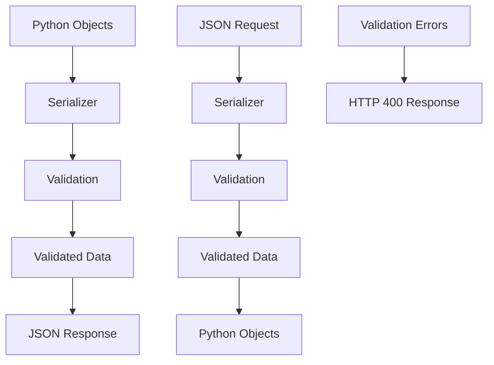
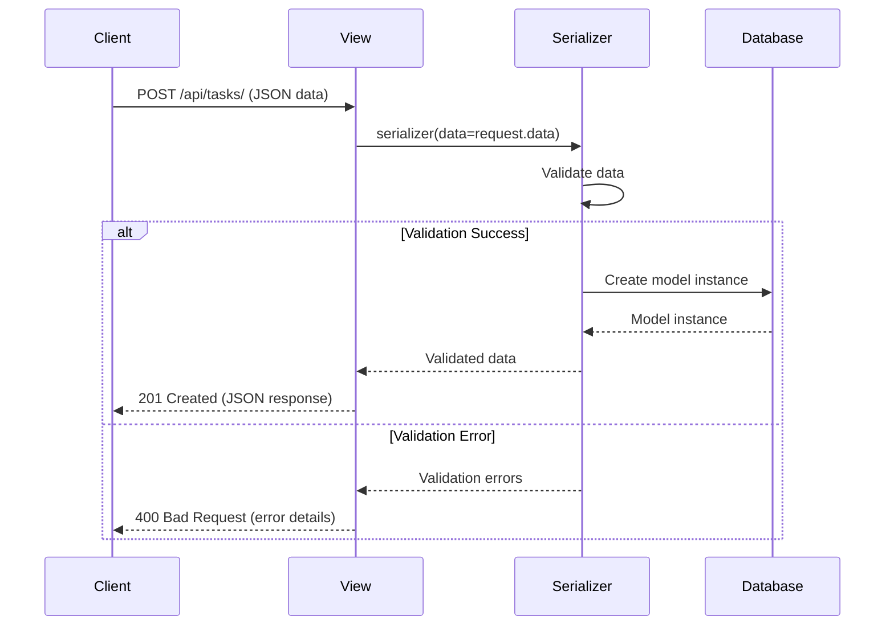
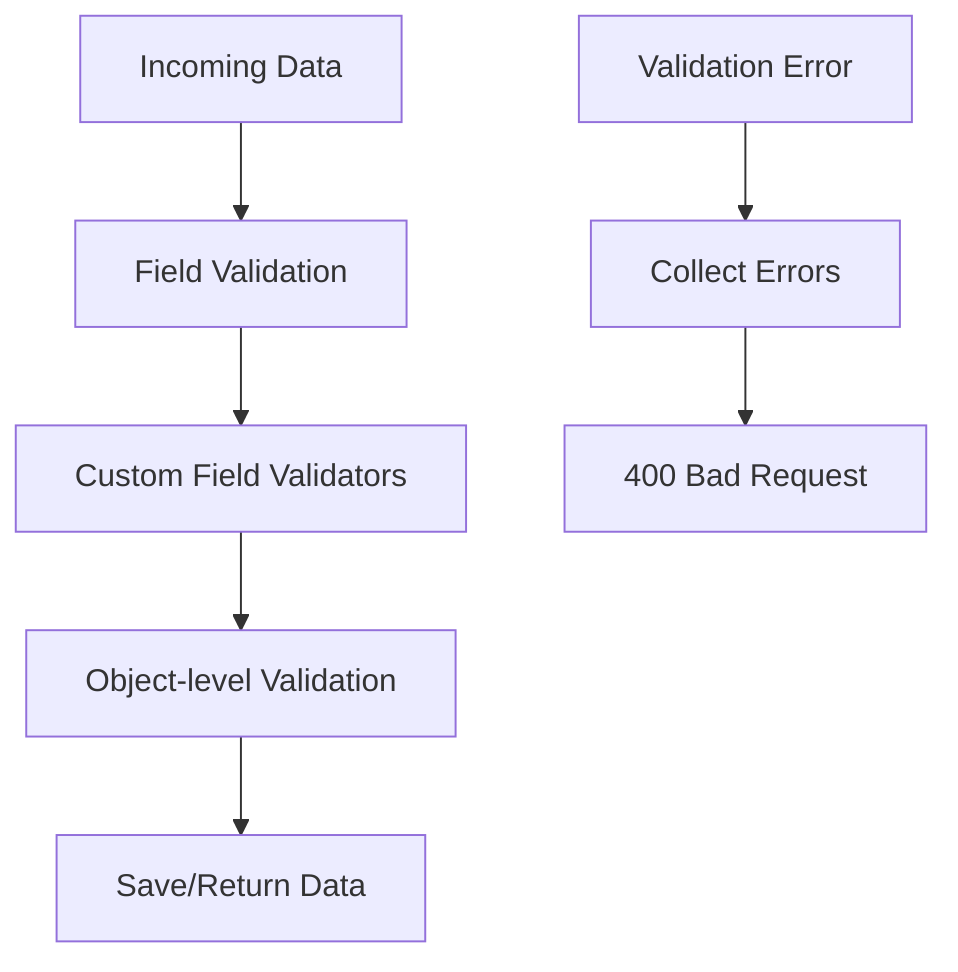

# Serializers and Data Validation 🔄

In this comprehensive guide, we'll explore Django REST Framework serializers and how they handle data validation, serialization, and deserialization. Serializers are a crucial component in any DRF application as they bridge the gap between complex data types and Python primitives.

## 📚 Table of Contents

1. [🏗️ Overview](#️-overview)
2. [🔄 What are Serializers?](#-what-are-serializers)
3. [👥 User Serializers](#-user-serializers)
4. [📋 Task Serializers](#-task-serializers)
5. [✅ Validation Rules](#-validation-rules)
6. [🔧 Custom Validation](#-custom-validation)
7. [🎯 Advanced Serializer Features](#-advanced-serializer-features)
8. [📊 Serializer Fields](#-serializer-fields)
9. [🧪 Testing Serializers](#-testing-serializers)
10. [🚀 Best Practices](#-best-practices)

---

## 🏗️ Overview

### 🎯 What Serializers Do

Serializers in Django REST Framework handle two main tasks:

1. **Serialization**: Converting complex data types (like Django models) to native Python datatypes that can then be easily rendered into JSON, XML, or other content types.

2. **Deserialization**: Validating incoming data and converting it back into complex types, typically Django model instances.

### 🏛️ Serializer Architecture



### 🔄 Request/Response Flow



---

## 🔄 What are Serializers?

### 🎯 Core Concepts

Serializers are classes that provide:
- **Data validation**: Ensure incoming data meets requirements
- **Data transformation**: Convert between formats
- **Error handling**: Provide clear error messages
- **Type conversion**: Handle different data types

### 🏗️ Basic Serializer Structure

```python
from rest_framework import serializers
from .models import Task

class TaskSerializer(serializers.ModelSerializer):
    """
    Serializer for Task model.
    Handles serialization and validation of task data.
    """
    class Meta:
        model = Task
        fields = '__all__'
```

### 📋 Serializer vs ModelSerializer

#### **Serializer Class**
- **More control**: You define all fields explicitly
- **Custom logic**: Can include non-model fields
- **Complex validation**: More flexible validation logic

```python
class TaskSerializer(serializers.Serializer):
    title = serializers.CharField(max_length=255)
    description = serializers.CharField(required=False)
    completed = serializers.BooleanField(default=False)

    def create(self, validated_data):
        return Task.objects.create(**validated_data)

    def update(self, instance, validated_data):
        instance.title = validated_data.get('title', instance.title)
        instance.description = validated_data.get('description', instance.description)
        instance.completed = validated_data.get('completed', instance.completed)
        instance.save()
        return instance
```

#### **ModelSerializer Class**
- **Auto-generated fields**: Based on model fields
- **Less boilerplate**: Automatic validation based on model
- **Built-in create/update**: Automatic methods

```python
class TaskSerializer(serializers.ModelSerializer):
    class Meta:
        model = Task
        fields = '__all__'
```

---

## 👥 User Serializers

### 📝 User Registration Serializer

```python
# users/serializers.py
from django.contrib.auth.models import User
from rest_framework import serializers
from django.core.exceptions import ValidationError

class UserSerializer(serializers.ModelSerializer):
    """
    Serializer for user registration and profile data.
    Includes password confirmation and email validation.
    """
    password = serializers.CharField(
        write_only=True,
        min_length=8,
        style={'input_type': 'password'},
        help_text="Password must be at least 8 characters long"
    )
    password_confirm = serializers.CharField(
        write_only=True,
        style={'input_type': 'password'},
        help_text="Confirm your password"
    )

    class Meta:
        model = User
        fields = (
            'id', 'username', 'email', 'first_name', 'last_name',
            'password', 'password_confirm', 'date_joined'
        )
        read_only_fields = ('id', 'date_joined')
        extra_kwargs = {
            'username': {
                'min_length': 3,
                'max_length': 150,
                'help_text': 'Required. 150 characters or fewer. Letters, digits and @/./+/-/_ only.'
            },
            'email': {
                'required': True,
                'help_text': 'Required. Enter a valid email address.'
            }
        }

    def validate_email(self, value):
        """
        Validate that email is unique and properly formatted.
        """
        # Normalize email address
        email = value.lower().strip()

        # Check if email already exists
        if User.objects.filter(email=email).exists():
            raise serializers.ValidationError(
                "A user with this email address already exists."
            )

        return email

    def validate_username(self, value):
        """
        Validate username uniqueness and format.
        """
        # Check if username already exists
        if User.objects.filter(username__iexact=value).exists():
            raise serializers.ValidationError(
                "A user with this username already exists."
            )

        # Check for forbidden usernames
        forbidden_usernames = ['admin', 'root', 'api', 'www', 'mail']
        if value.lower() in forbidden_usernames:
            raise serializers.ValidationError(
                "This username is not allowed."
            )

        return value

    def validate(self, data):
        """
        Validate that passwords match and additional cross-field validation.
        """
        password = data.get('password')
        password_confirm = data.get('password_confirm')

        # Check if passwords match
        if password != password_confirm:
            raise serializers.ValidationError({
                'password_confirm': "Passwords don't match."
            })

        # Validate password strength
        if password:
            self.validate_password_strength(password)

        return data

    def validate_password_strength(self, password):
        """
        Custom password strength validation.
        """
        errors = []

        # Check for minimum length
        if len(password) < 8:
            errors.append("Password must be at least 8 characters long.")

        # Check for uppercase letter
        if not any(c.isupper() for c in password):
            errors.append("Password must contain at least one uppercase letter.")

        # Check for lowercase letter
        if not any(c.islower() for c in password):
            errors.append("Password must contain at least one lowercase letter.")

        # Check for digit
        if not any(c.isdigit() for c in password):
            errors.append("Password must contain at least one digit.")

        # Check for special character
        special_chars = "!@#$%^&*()_+-=[]{}|;:,.<>?"
        if not any(c in special_chars for c in password):
            errors.append("Password must contain at least one special character.")

        # Check if password is too common
        common_passwords = ['password', '12345678', 'qwerty', 'admin']
        if password.lower() in common_passwords:
            errors.append("This password is too common. Please choose a different one.")

        if errors:
            raise serializers.ValidationError({
                'password': errors
            })

    def create(self, validated_data):
        """
        Create user with hashed password.
        """
        # Remove password_confirm as it's not needed for user creation
        validated_data.pop('password_confirm')

        # Create user with hashed password
        user = User.objects.create_user(**validated_data)
        return user

    def to_representation(self, instance):
        """
        Customize the output representation.
        """
        data = super().to_representation(instance)
        # Remove sensitive fields from response
        data.pop('password', None)
        data.pop('password_confirm', None)
        return data
```

### 📄 User Profile Serializer

```python
class UserProfileSerializer(serializers.ModelSerializer):
    """
    Serializer for user profile information (read-only).
    """
    full_name = serializers.SerializerMethodField()
    task_count = serializers.SerializerMethodField()

    class Meta:
        model = User
        fields = (
            'id', 'username', 'email', 'first_name', 'last_name',
            'full_name', 'date_joined', 'last_login', 'task_count'
        )
        read_only_fields = fields

    def get_full_name(self, obj):
        """
        Get user's full name.
        """
        return f"{obj.first_name} {obj.last_name}".strip() or obj.username

    def get_task_count(self, obj):
        """
        Get number of tasks for this user.
        """
        from tasks.models import Task
        return Task.objects.filter(user=obj).count()
```

---

## 📋 Task Serializers

### 📝 Task Serializer Implementation

```python
# tasks/serializers.py
from rest_framework import serializers
from django.contrib.auth.models import User
from .models import Task

class TaskSerializer(serializers.ModelSerializer):
    """
    Serializer for Task model with custom validation and fields.
    """
    # Read-only fields automatically set by the system
    id = serializers.IntegerField(read_only=True)
    user = serializers.PrimaryKeyRelatedField(read_only=True)
    created_at = serializers.DateTimeField(read_only=True)
    updated_at = serializers.DateTimeField(read_only=True)

    # Custom field for time ago display
    time_ago = serializers.SerializerMethodField()
    status = serializers.SerializerMethodField()

    class Meta:
        model = Task
        fields = (
            'id', 'user', 'title', 'description', 'completed',
            'created_at', 'updated_at', 'time_ago', 'status'
        )
        extra_kwargs = {
            'title': {
                'error_messages': {
                    'required': 'Title is required.',
                    'blank': 'Title cannot be blank.',
                    'max_length': 'Title cannot exceed 255 characters.'
                }
            },
            'description': {
                'required': False,
                'allow_blank': True,
                'allow_null': True,
                'error_messages': {
                    'blank': 'Description cannot be blank when provided.'
                }
            },
            'completed': {
                'default': False,
                'error_messages': {
                    'invalid': 'Completed status must be true or false.'
                }
            }
        }

    def get_time_ago(self, obj):
        """
        Get human-readable time ago format.
        """
        from django.utils import timezone
        from datetime import timedelta

        now = timezone.now()
        diff = now - obj.created_at

        if diff < timedelta(minutes=1):
            return "just now"
        elif diff < timedelta(hours=1):
            minutes = diff.seconds // 60
            return f"{minutes} minute{'s' if minutes != 1 else ''} ago"
        elif diff < timedelta(days=1):
            hours = diff.seconds // 3600
            return f"{hours} hour{'s' if hours != 1 else ''} ago"
        else:
            days = diff.days
            return f"{days} day{'s' if days != 1 else ''} ago"

    def get_status(self, obj):
        """
        Get human-readable status.
        """
        return "Completed" if obj.completed else "Pending"

    def validate_title(self, value):
        """
        Custom validation for title field.
        """
        title = value.strip()

        # Check if title is empty after stripping
        if not title:
            raise serializers.ValidationError("Title cannot be empty or just whitespace.")

        # Check for minimum length
        if len(title) < 3:
            raise serializers.ValidationError(
                "Title must be at least 3 characters long."
            )

        # Check for profanity or inappropriate content
        forbidden_words = ['spam', 'advertisement', 'promotion']
        if any(word in title.lower() for word in forbidden_words):
            raise serializers.ValidationError(
                "Title contains inappropriate content."
            )

        return title

    def validate_description(self, value):
        """
        Custom validation for description field.
        """
        if value:
            description = value.strip()

            # Check length limits
            if len(description) > 1000:
                raise serializers.ValidationError(
                    "Description cannot exceed 1000 characters."
                )

            # Check for potentially malicious content
            suspicious_patterns = ['http://', 'https://', 'www.']
            if any(pattern in description.lower() for pattern in suspicious_patterns):
                raise serializers.ValidationError(
                    "Description cannot contain URLs or links."
                )

            return description

        return value

    def validate(self, data):
        """
        Cross-field validation.
        """
        title = data.get('title', '')
        description = data.get('description', '')

        # Check if title and description are the same
        if title and description and title.strip() == description.strip():
            raise serializers.ValidationError(
                "Title and description cannot be identical."
            )

        # Check for excessive repetition
        if title and self.has_excessive_repetition(title):
            raise serializers.ValidationError({
                'title': 'Title contains excessive repetition of characters.'
            })

        return data

    def has_excessive_repetition(self, text, max_repeats=3):
        """
        Check if text has excessive character repetition.
        """
        import re
        pattern = rf'(.)\1{{{max_repeats},}}'
        return bool(re.search(pattern, text))

    def create(self, validated_data):
        """
        Create task with automatic user assignment.
        """
        # User is automatically set from request context
        user = self.context['request'].user
        validated_data['user'] = user

        task = Task.objects.create(**validated_data)
        return task

    def update(self, instance, validated_data):
        """
        Update task with validation.
        """
        # Check if user is trying to modify protected fields
        protected_fields = ['user', 'created_at']
        for field in protected_fields:
            if field in validated_data:
                validated_data.pop(field)

        # Update task
        for attr, value in validated_data.items():
            setattr(instance, attr, value)

        instance.save()
        return instance

    def to_representation(self, instance):
        """
        Customize the output representation.
        """
        data = super().to_representation(instance)

        # Format dates for better readability
        if data.get('created_at'):
            from django.utils import timezone
            data['created_at'] = instance.created_at.isoformat()

        if data.get('updated_at'):
            data['updated_at'] = instance.updated_at.isoformat()

        return data
```

### 📊 Task List Serializer

```python
class TaskListSerializer(serializers.ModelSerializer):
    """
    Lightweight serializer for task list views.
    """
    time_ago = serializers.SerializerMethodField()
    status = serializers.SerializerMethodField()

    class Meta:
        model = Task
        fields = ('id', 'title', 'completed', 'created_at', 'time_ago', 'status')

    def get_time_ago(self, obj):
        """Get human-readable time ago format."""
        from django.utils import timezone
        from datetime import timedelta

        diff = timezone.now() - obj.created_at
        if diff < timedelta(hours=1):
            return f"{diff.seconds // 60}m ago"
        elif diff < timedelta(days=1):
            return f"{diff.seconds // 3600}h ago"
        else:
            return f"{diff.days}d ago"

    def get_status(self, obj):
        """Get human-readable status."""
        return "Completed" if obj.completed else "Pending"
```

---

## ✅ Validation Rules

### 🎯 Validation Process Flow



### 📋 Validation Hierarchy

1. **Field-level Validation**: Individual field validation
2. **Cross-field Validation**: Object-level validation using multiple fields
3. **Custom Validators**: Reusable validation functions
4. **Model Validation**: Django's built-in model validation

### 🛠️ Built-in Validators

#### **Common Built-in Validators**

```python
from rest_framework import serializers
from django.core.validators import RegexValidator, MinLengthValidator, MaxLengthValidator

class TaskSerializer(serializers.ModelSerializer):
    title = serializers.CharField(
        validators=[
            MinLengthValidator(3, message="Title must be at least 3 characters."),
            MaxLengthValidator(255, message="Title cannot exceed 255 characters."),
            RegexValidator(
                regex=r'^[A-Za-z0-9\s\-_,.!?]+$',
                message="Title can only contain letters, numbers, and basic punctuation."
            )
        ]
    )
```

#### **Unique Validators**

```python
class ProjectSerializer(serializers.ModelSerializer):
    name = serializers.CharField(
        validators=[UniqueValidator(
            queryset=Project.objects.all(),
            message="A project with this name already exists."
        )]
    )
```

### 🎯 Custom Validation Methods

#### **Field-level Validation**

```python
def validate_title(self, value):
    """
    Custom validation for the title field.
    """
    # Strip whitespace
    title = value.strip()

    # Validation logic
    if len(title) < 3:
        raise serializers.ValidationError("Title must be at least 3 characters long.")

    # Check for forbidden words
    forbidden_words = ['spam', 'advertisement']
    if any(word in title.lower() for word in forbidden_words):
        raise serializers.ValidationError("Title contains inappropriate content.")

    return title
```

#### **Object-level Validation**

```python
def validate(self, data):
    """
    Cross-field validation.
    """
    title = data.get('title', '')
    description = data.get('description', '')

    # Example: Title and description cannot be identical
    if title and description and title.strip() == description.strip():
        raise serializers.ValidationError({
            'description': 'Description cannot be identical to title.'
        })

    return data
```

---

## 🔧 Custom Validation

### 🛠️ Custom Validator Functions

Create reusable validation functions:

```python
# validators.py
import re
from django.core.exceptions import ValidationError
from rest_framework import serializers

def validate_no_special_characters(value):
    """
    Validator to ensure no special characters except basic punctuation.
    """
    if not re.match(r'^[A-Za-z0-9\s\-_,.!?]+$', value):
        raise serializers.ValidationError(
            "Only letters, numbers, and basic punctuation are allowed."
        )
    return value

def validate_profanity(value):
    """
    Validator to check for profanity.
    """
    profanity_list = ['damn', 'hell', 'spam']  # In practice, use a comprehensive list
    if any(word in value.lower() for word in profanity_list):
        raise serializers.ValidationError("Content contains inappropriate language.")
    return value

def validate_url_safe(value):
    """
    Validator to ensure URL-safe content.
    """
    dangerous_patterns = ['<script', 'javascript:', 'data:text/html']
    if any(pattern in value.lower() for pattern in dangerous_patterns):
        raise serializers.ValidationError("Content contains potentially dangerous elements.")
    return value
```

### 🔧 Using Custom Validators

```python
class TaskSerializer(serializers.ModelSerializer):
    title = serializers.CharField(
        validators=[validate_no_special_characters, validate_profanity]
    )
    description = serializers.CharField(
        validators=[validate_url_safe],
        required=False,
        allow_blank=True
    )
```

### 🎯 Complex Validation Example

```python
class ComplexTaskSerializer(serializers.ModelSerializer):
    """
    Example of complex validation with multiple scenarios.
    """
    title = serializers.CharField(max_length=255)
    description = serializers.CharField(required=False, allow_blank=True)
    priority = serializers.ChoiceField(
        choices=['low', 'medium', 'high', 'urgent'],
        default='medium'
    )
    due_date = serializers.DateField(required=False, allow_null=True)
    estimated_hours = serializers.DecimalField(
        max_digits=5, decimal_places=2, required=False, allow_null=True
    )

    def validate_priority(self, value):
        """
        Validate priority based on user role or other conditions.
        """
        user = self.context['request'].user

        # Only staff users can create urgent tasks
        if value == 'urgent' and not user.is_staff:
            raise serializers.ValidationError(
                "Only staff members can create urgent tasks."
            )

        return value

    def validate_due_date(self, value):
        """
        Validate due date is not in the past.
        """
        from datetime import date

        if value and value < date.today():
            raise serializers.ValidationError(
                "Due date cannot be in the past."
            )

        return value

    def validate_estimated_hours(self, value):
        """
        Validate estimated hours is reasonable.
        """
        if value and (value < 0.5 or value > 100):
            raise serializers.ValidationError(
                "Estimated hours must be between 0.5 and 100."
            )

        return value

    def validate(self, data):
        """
        Cross-field validation.
        """
        priority = data.get('priority')
        due_date = data.get('due_date')
        estimated_hours = data.get('estimated_hours')

        # High priority tasks must have due dates
        if priority in ['high', 'urgent'] and not due_date:
            raise serializers.ValidationError({
                'due_date': 'High priority tasks must have a due date.'
            })

        # Urgent tasks should have estimated hours
        if priority == 'urgent' and not estimated_hours:
            raise serializers.ValidationError({
                'estimated_hours': 'Urgent tasks should have estimated hours.'
            })

        # Validate time estimation vs due date
        if due_date and estimated_hours:
            from datetime import date, timedelta
            max_days = int(estimated_hours / 8)  # Assuming 8-hour workdays
            latest_start = due_date - timedelta(days=max_days)

            if latest_start < date.today():
                raise serializers.ValidationError(
                    "Given the estimated hours, this task cannot be completed by the due date."
                )

        return data
```

---

## 🎯 Advanced Serializer Features

### 🔧 Dynamic Fields

```python
class DynamicFieldsTaskSerializer(serializers.ModelSerializer):
    """
    Serializer that dynamically includes fields based on query parameters.
    """
    def __init__(self, *args, **kwargs):
        # Don't pass 'fields' kwarg to the superclass
        fields = kwargs.pop('fields', None)

        super().__init__(*args, **kwargs)

        if fields is not None:
            # Drop any fields that are not specified in the `fields` argument.
            allowed = set(fields.split(','))
            existing = set(self.fields)
            for field_name in existing - allowed:
                self.fields.pop(field_name)

    class Meta:
        model = Task
        fields = '__all__'

# Usage in view
fields = self.request.query_params.get('fields', None)
serializer = DynamicFieldsTaskSerializer(task, fields=fields)
```

### 🎯 Nested Serializers

```python
class CommentSerializer(serializers.ModelSerializer):
    author = UserProfileSerializer(read_only=True)

    class Meta:
        model = Comment
        fields = ('id', 'content', 'author', 'created_at')

class TaskWithCommentsSerializer(serializers.ModelSerializer):
    """
    Task serializer with nested comments.
    """
    comments = CommentSerializer(many=True, read_only=True)
    comment_count = serializers.SerializerMethodField()

    class Meta:
        model = Task
        fields = (
            'id', 'title', 'description', 'completed', 'created_at',
            'comments', 'comment_count'
        )

    def get_comment_count(self, obj):
        return obj.comments.count()
```

### 🔧 SerializerMethodField

```python
class TaskAnalyticsSerializer(serializers.ModelSerializer):
    """
    Serializer with computed fields.
    """
    completion_percentage = serializers.SerializerMethodField()
    is_overdue = serializers.SerializerMethodField()
    urgency_level = serializers.SerializerMethodField()
    estimated_completion_time = serializers.SerializerMethodField()

    class Meta:
        model = Task
        fields = (
            'id', 'title', 'completed', 'created_at', 'due_date',
            'completion_percentage', 'is_overdue', 'urgency_level',
            'estimated_completion_time'
        )

    def get_completion_percentage(self, obj):
        """
        Calculate completion percentage based on various factors.
        """
        if obj.completed:
            return 100

        from datetime import datetime, timedelta

        # Simple logic: based on time elapsed
        if hasattr(obj, 'due_date') and obj.due_date:
            total_time = obj.due_date - obj.created_at.date()
            elapsed = datetime.now().date() - obj.created_at.date()

            if total_time.days > 0:
                return min(100, (elapsed.days / total_time.days) * 100)

        return 0

    def get_is_overdue(self, obj):
        """
        Check if task is overdue.
        """
        if obj.completed or not hasattr(obj, 'due_date') or not obj.due_date:
            return False

        from datetime import date
        return date.today() > obj.due_date

    def get_urgency_level(self, obj):
        """
        Calculate urgency level based on various factors.
        """
        if obj.completed:
            return "Completed"

        if hasattr(obj, 'due_date') and obj.due_date:
            from datetime import date, timedelta

            days_until_due = (obj.due_date - date.today()).days

            if days_until_due < 0:
                return "Overdue"
            elif days_until_due <= 1:
                return "Urgent"
            elif days_until_due <= 3:
                return "High"
            elif days_until_due <= 7:
                return "Medium"
            else:
                return "Low"

        return "Normal"

    def get_estimated_completion_time(self, obj):
        """
        Estimate completion time based on historical data.
        """
        # This would typically involve more complex logic
        # based on user's historical task completion times
        return "2 days"  # Placeholder
```

### 🎯 Conditional Serialization

```python
class ConditionalTaskSerializer(serializers.ModelSerializer):
    """
    Serializer that conditionally includes fields based on user permissions.
    """
    internal_notes = serializers.CharField(
        required=False,
        write_only=True
    )

    class Meta:
        model = Task
        fields = '__all__'

    def to_representation(self, instance):
        """
        Customize output based on user permissions.
        """
        data = super().to_representation(instance)
        user = self.context['request'].user

        # Remove internal notes unless user is staff or task owner
        if not (user.is_staff or instance.user == user):
            data.pop('internal_notes', None)

        # Add extra fields for staff users
        if user.is_staff:
            data['is_assigned_to_staff'] = instance.user.is_staff
            data['user_email'] = instance.user.email

        return data
```

---

## 📊 Serializer Fields

### 🎯 Common Serializer Fields

#### **CharField**
```python
title = serializers.CharField(
    max_length=255,
    min_length=3,
    allow_blank=False,
    trim_whitespace=True,
    error_messages={
        'required': 'Title is required.',
        'blank': 'Title cannot be blank.',
        'min_length': 'Title must be at least 3 characters long.',
        'max_length': 'Title cannot exceed 255 characters.'
    }
)
```

#### **EmailField**
```python
email = serializers.EmailField(
    required=True,
    allow_blank=False,
    error_messages={
        'invalid': 'Enter a valid email address.',
        'required': 'Email is required.'
    }
)
```

#### **BooleanField**
```python
completed = serializers.BooleanField(
    default=False,
    required=False,
    error_messages={
        'invalid': 'Completed status must be true or false.'
    }
)
```

#### **DateTimeField**
```python
created_at = serializers.DateTimeField(
    read_only=True,
    format='%Y-%m-%d %H:%M:%S',
    input_formats=['%Y-%m-%d %H:%M:%S', 'iso-8601']
)
```

#### **ChoiceField**
```python
priority = serializers.ChoiceField(
    choices=[
        ('low', 'Low'),
        ('medium', 'Medium'),
        ('high', 'High'),
        ('urgent', 'Urgent')
    ],
    default='medium',
    error_messages={
        'invalid_choice': 'Invalid priority level selected.'
    }
)
```

#### **DecimalField**
```python
estimated_hours = serializers.DecimalField(
    max_digits=5,
    decimal_places=2,
    min_value=0.5,
    max_value=100,
    required=False,
    allow_null=True,
    error_messages={
        'min_value': 'Estimated hours must be at least 0.5.',
        'max_value': 'Estimated hours cannot exceed 100.',
        'invalid': 'Enter a valid number.'
    }
)
```

### 🎯 Relationship Fields

#### **PrimaryKeyRelatedField**
```python
user = serializers.PrimaryKeyRelatedField(
    read_only=True,
    help_text="ID of the user who owns this task"
)
```

#### **StringRelatedField**
```python
user = serializers.StringRelatedField(
    read_only=True
)
# Output: "john_doe"
```

#### **SlugRelatedField**
```python
user = serializers.SlugRelatedField(
    slug_field='username',
    read_only=True
)
# Output: {"user": "john_doe"}
```

#### **Nested Serializer**
```python
user = UserProfileSerializer(
    read_only=True
)
# Output: {"user": {"id": 1, "username": "john_doe", "email": "john@example.com"}}
```

---

## 🧪 Testing Serializers

### 🧪 Basic Serializer Testing

```python
# tasks/tests.py
from django.test import TestCase
from django.contrib.auth.models import User
from rest_framework.test import APITestCase
from rest_framework import status
from .serializers import TaskSerializer
from .models import Task

class TaskSerializerTestCase(APITestCase):
    def setUp(self):
        self.user = User.objects.create_user(
            username='testuser',
            email='test@example.com',
            password='testpass123'
        )
        self.task_data = {
            'title': 'Test Task',
            'description': 'Test Description',
            'completed': False
        }

    def test_valid_task_serialization(self):
        """
        Test that valid data can be serialized.
        """
        task = Task.objects.create(user=self.user, **self.task_data)
        serializer = TaskSerializer(task)

        self.assertIn('id', serializer.data)
        self.assertIn('title', serializer.data)
        self.assertEqual(serializer.data['title'], 'Test Task')
        self.assertEqual(serializer.data['user'], self.user.id)

    def test_valid_task_deserialization(self):
        """
        Test that valid data can be deserialized.
        """
        serializer = TaskSerializer(data=self.task_data)
        self.assertTrue(serializer.is_valid())

        # Check that all fields are in validated data
        validated_data = serializer.validated_data
        self.assertEqual(validated_data['title'], 'Test Task')
        self.assertEqual(validated_data['description'], 'Test Description')
        self.assertFalse(validated_data['completed'])

    def test_required_field_validation(self):
        """
        Test that required fields are validated.
        """
        invalid_data = {'description': 'No title provided'}
        serializer = TaskSerializer(data=invalid_data)

        self.assertFalse(serializer.is_valid())
        self.assertIn('title', serializer.errors)
        self.assertEqual(serializer.errors['title'][0], 'This field is required.')

    def test_title_min_length_validation(self):
        """
        Test title minimum length validation.
        """
        invalid_data = {**self.task_data, 'title': 'Hi'}  # Too short
        serializer = TaskSerializer(data=invalid_data)

        self.assertFalse(serializer.is_valid())
        self.assertIn('title', serializer.errors)

    def test_title_max_length_validation(self):
        """
        Test title maximum length validation.
        """
        invalid_data = {
            **self.task_data,
            'title': 'x' * 256  # Too long (255 is max)
        }
        serializer = TaskSerializer(data=invalid_data)

        self.assertFalse(serializer.is_valid())
        self.assertIn('title', serializer.errors)

    def test_custom_title_validation(self):
        """
        Test custom title validation (forbidden words).
        """
        invalid_data = {**self.task_data, 'title': 'This is spam content'}
        serializer = TaskSerializer(data=invalid_data)

        self.assertFalse(serializer.is_valid())
        self.assertIn('title', serializer.errors)

    def test_cross_field_validation(self):
        """
        Test cross-field validation.
        """
        invalid_data = {
            'title': 'Same Content',
            'description': 'Same Content'  # Same as title
        }
        serializer = TaskSerializer(data=invalid_data)

        self.assertFalse(serializer.is_valid())
        # Cross-field validation errors typically go in non_field_errors
        self.assertTrue(len(serializer.errors) > 0)

    def test_serializer_create(self):
        """
        Test that serializer can create objects.
        """
        serializer = TaskSerializer(
            data=self.task_data,
            context={'request': type('MockRequest', (), {'user': self.user})}
        )
        self.assertTrue(serializer.is_valid())

        task = serializer.save()

        self.assertIsInstance(task, Task)
        self.assertEqual(task.title, 'Test Task')
        self.assertEqual(task.user, self.user)
        self.assertFalse(task.completed)

    def test_serializer_update(self):
        """
        Test that serializer can update objects.
        """
        task = Task.objects.create(user=self.user, **self.task_data)

        update_data = {
            'title': 'Updated Title',
            'completed': True
        }
        serializer = TaskSerializer(task, data=update_data, partial=True)
        self.assertTrue(serializer.is_valid())

        updated_task = serializer.save()

        self.assertEqual(updated_task.title, 'Updated Title')
        self.assertTrue(updated_task.completed)
        # Unchanged fields remain the same
        self.assertEqual(updated_task.description, 'Test Description')

    def test_readonly_fields_unchanged(self):
        """
        Test that read-only fields cannot be modified.
        """
        task = Task.objects.create(user=self.user, **self.task_data)

        # Try to modify read-only fields
        update_data = {
            'id': 999,  # Try to change ID
            'user': 2,   # Try to change user
            'created_at': '2020-01-01T00:00:00Z'  # Try to change creation time
        }
        serializer = TaskSerializer(task, data=update_data, partial=True)
        self.assertTrue(serializer.is_valid())

        updated_task = serializer.save()

        # Read-only fields should remain unchanged
        self.assertEqual(updated_task.id, task.id)
        self.assertEqual(updated_task.user, task.user)
        self.assertEqual(updated_task.created_at, task.created_at)

    def test_to_representation_customization(self):
        """
        Test custom to_representation method.
        """
        task = Task.objects.create(user=self.user, **self.task_data)
        serializer = TaskSerializer(task)
        data = serializer.to_representation(task)

        # Check that custom fields are present
        self.assertIn('time_ago', data)
        self.assertIn('status', data)
        self.assertEqual(data['status'], 'Pending')
```

### 🧪 Integration Testing

```python
class TaskSerializerIntegrationTestCase(APITestCase):
    def setUp(self):
        self.user = User.objects.create_user(
            username='testuser',
            email='test@example.com',
            password='testpass123'
        )
        self.client.force_authenticate(user=self.user)

    def test_serializer_in_view_context(self):
        """
        Test serializer behavior in actual view context.
        """
        # Test creating task through API
        task_data = {
            'title': 'API Task',
            'description': 'Created through API'
        }
        response = self.client.post('/api/tasks/', task_data)

        self.assertEqual(response.status_code, status.HTTP_201_CREATED)

        # Verify task was created with correct data
        task = Task.objects.get(id=response.data['id'])
        self.assertEqual(task.title, 'API Task')
        self.assertEqual(task.user, self.user)

    def test_serializer_error_handling_in_view(self):
        """
        Test that serializer errors are properly handled in views.
        """
        invalid_data = {
            'title': '',  # Invalid: empty title
            'description': 'Some description'
        }
        response = self.client.post('/api/tasks/', invalid_data)

        self.assertEqual(response.status_code, status.HTTP_400_BAD_REQUEST)
        self.assertIn('title', response.data)
```

---

## 🚀 Best Practices

### ✅ Do's

1. **Keep serializers focused**: Each serializer should have a single responsibility
2. **Use clear validation messages**: Provide helpful error messages to users
3. **Implement comprehensive validation**: Validate at field and object levels
4. **Write thorough tests**: Test all validation scenarios and edge cases
5. **Use appropriate field types**: Choose the right field type for each piece of data
6. **Document custom validation**: Explain complex validation logic
7. **Keep serializers simple**: Avoid complex business logic in serializers

### ❌ Don'ts

1. **Don't put business logic in serializers**: Keep business logic in models or services
2. **Don't use serializers for complex queries**: Use views or services for complex data retrieval
3. **Don't ignore performance**: Be careful with nested serializers that can cause N+1 queries
4. **Don't skip validation**: Always validate incoming data
5. **Don't expose sensitive data**: Use read-only fields and exclude sensitive information

### 🚀 Performance Tips

#### **Optimize Nested Serializers**
```python
# Bad: Can cause N+1 queries
class TaskWithUserSerializer(serializers.ModelSerializer):
    user = UserProfileSerializer()  # Will query for each task

# Good: Use select_related to optimize
class TaskViewSet(viewsets.ModelViewSet):
    def get_queryset(self):
        return Task.objects.select_related('user').filter(user=self.request.user)
```

#### **Use Serializer Fields Wisely**
```python
# Lightweight serializer for list views
class TaskListSerializer(serializers.ModelSerializer):
    class Meta:
        model = Task
        fields = ('id', 'title', 'completed', 'created_at')

# Detailed serializer for detail views
class TaskDetailSerializer(serializers.ModelSerializer):
    class Meta:
        model = Task
        fields = '__all__'
```

#### **Conditional Field Inclusion**
```python
def __init__(self, *args, **kwargs):
    # Dynamically include fields based on context
    fields = kwargs.pop('fields', None)
    super().__init__(*args, **kwargs)

    if fields:
        allowed = set(fields.split(','))
        existing = set(self.fields)
        for field_name in existing - allowed:
            self.fields.pop(field_name)
```

---

## 🎉 Summary

In this comprehensive guide, we've covered:

- **🔄 Serializer Fundamentals**: Understanding serialization and deserialization
- **👥 User Serializers**: Complex user registration and profile serialization
- **📋 Task Serializers**: Feature-rich task management serialization
- **✅ Validation Rules**: Field-level and object-level validation
- **🔧 Custom Validation**: Creating reusable validation functions
- **🎯 Advanced Features**: Dynamic fields, nested serializers, conditional logic
- **📊 Serializer Fields**: Comprehensive field type guide
- **🧪 Testing**: Thorough testing strategies for serializers
- **🚀 Best Practices**: Performance optimization and design patterns

### 🎯 Key Takeaways

1. **Validation is Multi-layered**: Field, object, and custom validation work together
2. **Error Messages Matter**: Clear, helpful error messages improve user experience
3. **Performance Considerations**: Be mindful of database queries in nested serializers
4. **Test Thoroughly**: Comprehensive testing ensures reliable data handling
5. **Keep it Simple**: Focus on data transformation, not business logic

Serializers are a powerful feature of Django REST Framework that provide robust data validation and transformation capabilities. Mastering serializers will significantly improve your API development skills and help you build more reliable and maintainable applications.

**Next Steps**: Explore our [Setup and Development Guide](setup-development.md) to learn how to set up your development environment and start building with these patterns.